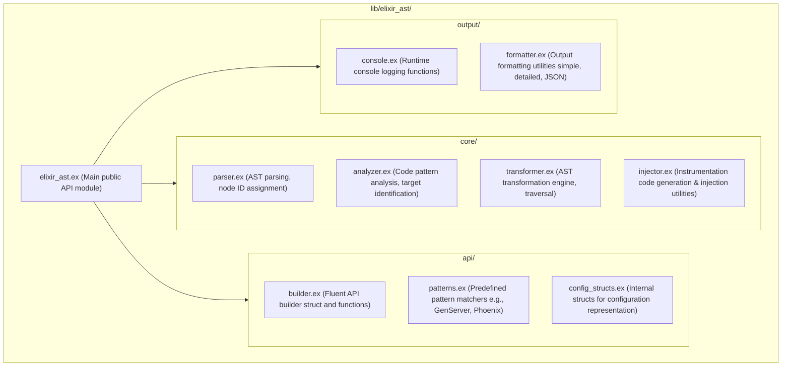
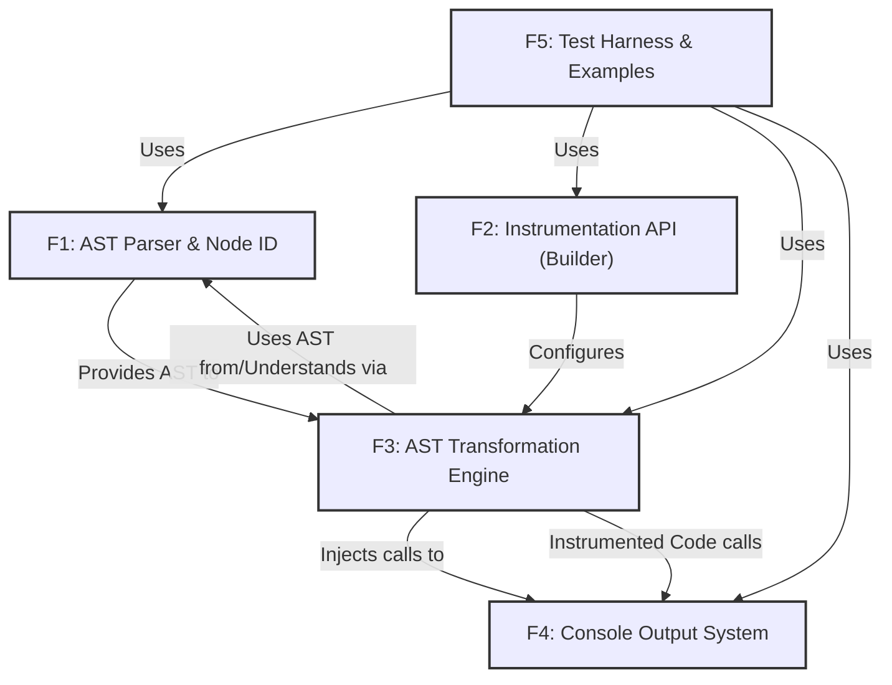

# Architectural Diagrams for ElixirAST

## 1. Core Components

```mermaid
graph TB
    subgraph "Input Layer"
        SOURCE[Source Code (String)]
        AST_INPUT[Raw AST (Optional)]
        CONFIG_BUILDER[Instrumentation Config (via Builder API)]
    end
    
    subgraph "ElixirAST Core Engine"
        PARSER[Core.Parser (Source -> AST, Node ID Assignment)]
        ANALYZER[Core.Analyzer (Pattern Detection, Target Identification)]
        TRANSFORMER[Core.Transformer (AST Traversal & Modification)]
        INJECTOR[Core.Injector (Instrumentation Code Generation)]
    end
    
    subgraph "Output & Runtime Support"
        INSTRUMENTED_AST[Instrumented AST (Output of Transform)]
        CONSOLE_LOGGER[Output.Console (Runtime Logging Utilities)]
    end
    
    subgraph "API Layer (ElixirAST Module)"
        PUBLIC_API[ElixirAST Public Functions]
        BUILDER_MODULE[ElixirAST.Builder (Fluent API State)]
        PATTERN_MODULE[ElixirAST.Patterns (Pattern Definitions)]
    end
    
    %% Input flow
    SOURCE --> PARSER
    AST_INPUT --> ANALYZER
    CONFIG_BUILDER --> ANALYZER
    
    %% Core processing
    PARSER --> ANALYZER
    ANALYZER --> TRANSFORMER
    TRANSFORMER --> INJECTOR
    
    %% API integration
    PUBLIC_API --> BUILDER_MODULE
    BUILDER_MODULE --> PATTERN_MODULE
    BUILDER_MODULE --> CONFIG_BUILDER
    
    %% Output
    INJECTOR --> INSTRUMENTED_AST
    
    %% Runtime (conceptual link for instrumented code)
    INSTRUMENTED_AST -.->|Instrumented code calls| CONSOLE_LOGGER
    
    %% Styling
    classDef inputClass fill:#e1f5fe,stroke:#333,stroke-width:2px
    classDef coreClass fill:#c8e6c9,stroke:#333,stroke-width:2px
    classDef outputClass fill:#fff3e0,stroke:#333,stroke-width:2px
    classDef apiClass fill:#f3e5f5,stroke:#333,stroke-width:2px
    
    class SOURCE,AST_INPUT,CONFIG_BUILDER inputClass
    class PARSER,ANALYZER,TRANSFORMER,INJECTOR coreClass
    class INSTRUMENTED_AST,CONSOLE_LOGGER outputClass
    class PUBLIC_API,BUILDER_MODULE,PATTERN_MODULE apiClass
```

## 2. Module Structure



## 3. MVP Feature Interactions


