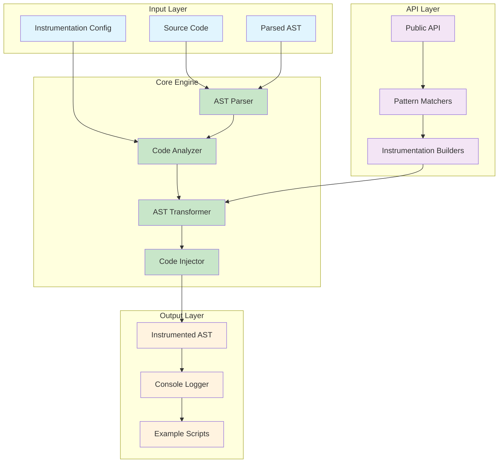

# ElixirAST: MVP Product Requirements Document
**Compile-Time AST Instrumentation Engine for Elixir**

## 1. Product Vision & Goals

### Vision Statement
ElixirAST is a **minimal, focused library** that provides clean, programmatic APIs for compile-time AST instrumentation in Elixir. It extracts the core innovation from ElixirScope—compile-time code transformation—into a reusable, standalone component.

### Primary Goals
1. **Simplicity**: Single-purpose library focused only on AST instrumentation
2. **Clean API**: Intuitive, composable interfaces for code transformation
3. **Zero Runtime Overhead**: All work happens at compile-time
4. **Developer Experience**: Console-based output for immediate feedback
5. **Reusability**: Foundation for larger debugging/observability tools

### Non-Goals (Explicitly Out of Scope)
- ❌ Event storage or persistence
- ❌ Runtime event collection infrastructure
- ❌ AI integration or analysis
- ❌ UI or visualization components
- ❌ Distributed tracing
- ❌ Production-ready observability

## 2. Target Users & Use Cases

### Primary Users
- **Library Authors**: Building debugging/observability tools
- **Framework Developers**: Adding instrumentation to Phoenix, LiveView, etc.
- **Elixir Developers**: Understanding code execution patterns
- **Tool Builders**: Creating custom analysis tools

### Key Use Cases
1. **Function Entry/Exit Logging**: Automatic logging of function calls
2. **Variable State Capture**: Snapshot local variables at specific points
3. **Expression Evaluation Tracking**: Log intermediate expression results
4. **Pattern Match Monitoring**: Track pattern matching success/failure
5. **Custom Instrumentation Points**: Insert arbitrary code at AST nodes

## 3. MVP Feature Requirements

### Core Features

#### ✅ **F1: AST Parser & Node Identification**
- Parse Elixir AST with unique node identification
- Generate stable, deterministic node IDs
- Support module, function, and expression-level parsing
- Handle all major Elixir constructs (def, case, if, pipe, etc.)

#### ✅ **F2: Instrumentation API**
- Clean, composable API for defining instrumentation
- Support for different instrumentation types (entry/exit, variable capture, custom)
- Chainable transformations
- Pattern-based targeting (e.g., "all GenServer functions")

#### ✅ **F3: AST Transformation Engine**
- Inject instrumentation code into AST
- Preserve original code semantics
- Handle edge cases (guards, pattern matching, macros)
- Generate efficient instrumentation code

#### ✅ **F4: Console Output System**
- Structured logging to console
- Configurable output formats (simple, detailed, JSON)
- Color-coded output for readability
- Performance timing information

#### ✅ **F5: Test Harness & Examples**
- Complete test suite demonstrating all features
- Example scripts showing common patterns
- Performance benchmarks
- Integration examples

### API Design Requirements

#### **R1: Declarative Configuration**
```elixir
instrumentation = ElixirAST.new()
|> ElixirAST.instrument_functions(:all)
|> ElixirAST.capture_variables([:result, :input])
|> ElixirAST.log_to(:console)
```

#### **R2: Pattern Matching**
```elixir
ElixirAST.new()
|> ElixirAST.target_pattern(:genserver_callbacks)
|> ElixirAST.on_entry(&log_function_entry/2)
|> ElixirAST.on_exit(&log_function_exit/2)
```

#### **R3: Custom Injection Points**
```elixir
ElixirAST.new()
|> ElixirAST.inject_at_line(42, quote do: IO.puts("Checkpoint reached") end)
|> ElixirAST.inject_before_return(&capture_result/1)
```

## 4. Technical Architecture

### Core Components



### Module Structure

```
lib/elixir_ast/
├── core/
│   ├── parser.ex              # AST parsing with node IDs
│   ├── analyzer.ex            # Code pattern analysis
│   ├── transformer.ex         # AST transformation engine
│   └── injector.ex            # Code injection utilities
├── api/
│   ├── builder.ex             # Fluent API builder
│   ├── patterns.ex            # Pattern matching utilities
│   └── config.ex              # Configuration structures
├── output/
│   ├── console.ex             # Console logging
│   └── formatter.ex           # Output formatting
└── elixir_ast.ex              # Main public API
```

### Performance Requirements

| Operation | Target | Measurement |
|-----------|--------|-------------|
| **AST Parsing** | <10ms per module | Time to parse and assign node IDs |
| **Instrumentation** | <50ms per module | Time to inject instrumentation |
| **Memory Usage** | <10MB per project | Total memory overhead |
| **Compilation Impact** | <20% overhead | Additional compile time |

## 5. API Specification

defmodule ElixirAST do
  @moduledoc """
  ElixirAST: Compile-Time AST Instrumentation Engine
  
  A clean, minimal library for programmatic AST instrumentation in Elixir.
  Focuses solely on compile-time code transformation with console output.
  
  ## Basic Usage
  
      ElixirAST.new()
      |> ElixirAST.instrument_functions(:all)
      |> ElixirAST.capture_variables([:result])
      |> ElixirAST.transform(ast)
  
  """

  alias ElixirAST.{Builder, Core}

  # ============================================================================
  # Core Types
  # ============================================================================

  @type ast_node() :: term()
  @type node_id() :: binary()
  @type instrumentation_config() :: %Builder{}
  @type transformation_result() :: {:ok, ast_node()} | {:error, term()}

  # ============================================================================
  # Main API - Builder Pattern
  # ============================================================================

  @doc """
  Create a new instrumentation configuration.
  
  ## Examples
  
      config = ElixirAST.new()
      config = ElixirAST.new(output_format: :json)
  """
  @spec new(keyword()) :: instrumentation_config()
  def new(opts \\ []) do
    Builder.new(opts)
  end

  @doc """
  Configure function instrumentation.
  
  ## Options
  
  - `:all` - Instrument all functions
  - `:public` - Only public functions
  - `:private` - Only private functions
  - `{:only, [atoms]}` - Specific functions only
  - `{:except, [atoms]}` - Exclude specific functions
  
  ## Examples
  
      ElixirAST.new()
      |> ElixirAST.instrument_functions(:all)
      
      ElixirAST.new()  
      |> ElixirAST.instrument_functions({:only, [:handle_call, :handle_cast]})
  """
  @spec instrument_functions(instrumentation_config(), atom() | tuple()) :: instrumentation_config()
  def instrument_functions(config, target) do
    Builder.instrument_functions(config, target)
  end

  @doc """
  Configure variable capture at function boundaries.
  
  ## Examples
  
      ElixirAST.new()
      |> ElixirAST.capture_variables([:input, :result, :state])
      
      ElixirAST.new()
      |> ElixirAST.capture_variables(:all)  # Capture all local variables
  """
  @spec capture_variables(instrumentation_config(), [atom()] | :all) :: instrumentation_config()
  def capture_variables(config, variables) do
    Builder.capture_variables(config, variables)
  end

  @doc """
  Configure expression tracking.
  
  Logs the result of specific expressions during execution.
  
  ## Examples
  
      ElixirAST.new()
      |> ElixirAST.track_expressions([
        quote(do: user |> validate() |> save()),
        quote(do: complex_calculation(x, y))
      ])
  """
  @spec track_expressions(instrumentation_config(), [ast_node()]) :: instrumentation_config()
  def track_expressions(config, expressions) do
    Builder.track_expressions(config, expressions)
  end

  @doc """
  Add custom injection points.
  
  ## Examples
  
      ElixirAST.new()
      |> ElixirAST.inject_at_line(42, quote do: IO.puts("Checkpoint") end)
      |> ElixirAST.inject_before_return(quote do: log_result(result) end)
      |> ElixirAST.inject_on_error(quote do: handle_error(error) end)
  """
  @spec inject_at_line(instrumentation_config(), integer(), ast_node()) :: instrumentation_config()
  def inject_at_line(config, line_number, code) do
    Builder.inject_at_line(config, line_number, code)
  end

  @spec inject_before_return(instrumentation_config(), ast_node()) :: instrumentation_config()
  def inject_before_return(config, code) do
    Builder.inject_before_return(config, code)
  end

  @spec inject_on_error(instrumentation_config(), ast_node()) :: instrumentation_config()
  def inject_on_error(config, code) do
    Builder.inject_on_error(config, code)
  end

  @doc """
  Configure pattern-based targeting.
  
  ## Built-in Patterns
  
  - `:genserver_callbacks` - GenServer callback functions
  - `:phoenix_actions` - Phoenix controller actions
  - `:public_functions` - All public functions
  - `:recursive_functions` - Self-recursive functions
  
  ## Examples
  
      ElixirAST.new()
      |> ElixirAST.target_pattern(:genserver_callbacks)
      |> ElixirAST.instrument_functions(:all)
  """
  @spec target_pattern(instrumentation_config(), atom()) :: instrumentation_config()
  def target_pattern(config, pattern) do
    Builder.target_pattern(config, pattern)
  end

  @doc """
  Configure output settings.
  
  ## Options
  
  - `:console` - Output to console (default)
  - `:structured` - Structured logging format
  - `:json` - JSON output format
  - `:silent` - No output (for testing)
  
  ## Examples
  
      ElixirAST.new()
      |> ElixirAST.output_to(:console)
      |> ElixirAST.format(:json)
  """
  @spec output_to(instrumentation_config(), atom()) :: instrumentation_config()
  def output_to(config, target) do
    Builder.output_to(config, target)
  end

  @spec format(instrumentation_config(), atom()) :: instrumentation_config()
  def format(config, format_type) do
    Builder.format(config, format_type)
  end

  # ============================================================================
  # Transformation API
  # ============================================================================

  @doc """
  Transform AST with configured instrumentation.
  
  This is the main transformation function that applies all configured
  instrumentation to the provided AST.
  
  ## Examples
  
      {:ok, ast} = Code.string_to_quoted(source_code)
      
      config = ElixirAST.new()
      |> ElixirAST.instrument_functions(:all)
      |> ElixirAST.capture_variables([:result])
      
      {:ok, instrumented_ast} = ElixirAST.transform(config, ast)
  """
  @spec transform(instrumentation_config(), ast_node()) :: transformation_result()
  def transform(config, ast) do
    Core.Transformer.transform(config, ast)
  end

  @doc """
  Parse source code and return AST with node IDs.
  
  ## Examples
  
      source = "def hello(name), do: IO.puts('Hello ' <> name)"
      {:ok, ast} = ElixirAST.parse(source)
  """
  @spec parse(binary()) :: {:ok, ast_node()} | {:error, term()}
  def parse(source_code) when is_binary(source_code) do
    Core.Parser.parse(source_code)
  end

  @doc """
  One-step parse and transform operation.
  
  ## Examples
  
      config = ElixirAST.new() |> ElixirAST.instrument_functions(:all)
      {:ok, instrumented_ast} = ElixirAST.parse_and_transform(config, source_code)
  """
  @spec parse_and_transform(instrumentation_config(), binary()) :: transformation_result()
  def parse_and_transform(config, source_code) do
    with {:ok, ast} <- parse(source_code),
         {:ok, instrumented_ast} <- transform(config, ast) do
      {:ok, instrumented_ast}
    end
  end

  # ============================================================================
  # Utility Functions
  # ============================================================================

  @doc """
  Analyze AST structure and return metadata.
  
  Useful for understanding what can be instrumented.
  
  ## Examples
  
      {:ok, ast} = ElixirAST.parse(source_code)
      analysis = ElixirAST.analyze(ast)
      
      # %{
      #   functions: [%{name: :hello, arity: 1, line: 1}],
      #   node_count: 15,
      #   complexity: :low
      # }
  """
  @spec analyze(ast_node()) :: map()
  def analyze(ast) do
    Core.Analyzer.analyze(ast)
  end

  @doc """
  Generate a preview of instrumentation without applying it.
  
  ## Examples
  
      config = ElixirAST.new() |> ElixirAST.instrument_functions(:all)
      preview = ElixirAST.preview(config, ast)
      
      # Shows what instrumentation points will be added
  """
  @spec preview(instrumentation_config(), ast_node()) :: map()
  def preview(config, ast) do
    Core.Transformer.preview(config, ast)
  end

  @doc """
  Validate instrumentation configuration.
  
  ## Examples
  
      config = ElixirAST.new() |> ElixirAST.instrument_functions(:invalid)
      case ElixirAST.validate(config) do
        :ok -> :proceed
        {:error, reasons} -> :fix_config
      end
  """
  @spec validate(instrumentation_config()) :: :ok | {:error, [term()]}
  def validate(config) do
    Builder.validate(config)
  end

  # ============================================================================
  # Convenience Functions
  # ============================================================================

  @doc """
  Quick function instrumentation with console output.
  
  ## Examples
  
      # Instrument all functions with entry/exit logging
      {:ok, ast} = ElixirAST.quick_instrument(source_code)
      
      # Instrument with variable capture
      {:ok, ast} = ElixirAST.quick_instrument(source_code, capture_vars: [:result])
  """
  @spec quick_instrument(binary(), keyword()) :: transformation_result()
  def quick_instrument(source_code, opts \\ []) do
    config = new()
    |> instrument_functions(:all)
    |> capture_variables(opts[:capture_vars] || [])
    |> output_to(:console)
    
    parse_and_transform(config, source_code)
  end

  @doc """
  GenServer-specific instrumentation.
  
  ## Examples
  
      {:ok, ast} = ElixirAST.instrument_genserver(source_code)
  """
  @spec instrument_genserver(binary(), keyword()) :: transformation_result()
  def instrument_genserver(source_code, opts \\ []) do
    config = new()
    |> target_pattern(:genserver_callbacks)
    |> instrument_functions(:all)
    |> capture_variables(opts[:capture_vars] || [:state])
    |> output_to(:console)
    
    parse_and_transform(config, source_code)
  end

  @doc """
  Phoenix controller instrumentation.
  
  ## Examples
  
      {:ok, ast} = ElixirAST.instrument_phoenix(source_code)
  """
  @spec instrument_phoenix(binary(), keyword()) :: transformation_result()
  def instrument_phoenix(source_code, opts \\ []) do
    config = new()
    |> target_pattern(:phoenix_actions)
    |> instrument_functions(:all)
    |> capture_variables(opts[:capture_vars] || [:conn, :params])
    |> output_to(:console)
    
    parse_and_transform(config, source_code)
  end

end

# ============================================================================
# Supporting Modules (API Overview)
# ============================================================================

defmodule ElixirAST.Builder do
  @moduledoc """
  Fluent API builder for instrumentation configuration.
  """
  
  defstruct [
    # Function targeting
    :function_targets,
    :pattern_targets,
    
    # Variable capture
    :captured_variables,
    :capture_mode,
    
    # Expression tracking
    :tracked_expressions,
    
    # Custom injections
    :line_injections,
    :return_injections,
    :error_injections,
    
    # Output configuration
    :output_target,
    :output_format,
    :verbose_mode
  ]
  
  # Implementation functions...
end

defmodule ElixirAST.Core.Parser do
  @moduledoc """
  AST parsing with unique node identification.
  """
  
  @spec parse(binary()) :: {:ok, ast_node()} | {:error, term()}
  def parse(source_code), do: :not_implemented
  
  @spec assign_node_ids(ast_node()) :: ast_node()
  def assign_node_ids(ast), do: :not_implemented
end

defmodule ElixirAST.Core.Analyzer do
  @moduledoc """
  Code analysis and pattern detection.
  """
  
  @spec analyze(ast_node()) :: map()
  def analyze(ast), do: :not_implemented
  
  @spec detect_patterns(ast_node()) :: [atom()]
  def detect_patterns(ast), do: :not_implemented
end

defmodule ElixirAST.Core.Transformer do
  @moduledoc """
  AST transformation and instrumentation injection.
  """
  
  @spec transform(instrumentation_config(), ast_node()) :: transformation_result()
  def transform(config, ast), do: :not_implemented
  
  @spec preview(instrumentation_config(), ast_node()) :: map()
  def preview(config, ast), do: :not_implemented
end

defmodule ElixirAST.Output.Console do
  @moduledoc """
  Console output formatting and logging.
  """
  
  @spec log_function_entry(atom(), [term()]) :: :ok
  def log_function_entry(function_name, args), do: :not_implemented
  
  @spec log_function_exit(atom(), term()) :: :ok  
  def log_function_exit(function_name, result), do: :not_implemented
  
  @spec log_variable_capture(map()) :: :ok
  def log_variable_capture(variables), do: :not_implemented
end

## 6. Implementation Plan


### Week 1: Core Foundation
**Days 1-2: Project Setup & Parser**
- [x] Project structure and dependencies
- [x] Core AST parser with node ID assignment  
- [x] Basic test framework setup
- [x] Documentation structure

**Days 3-5: Builder API**
- [ ] Fluent API builder implementation
- [ ] Configuration validation
- [ ] Pattern matching system
- [ ] Basic transformation pipeline

### Week 2: Transformation Engine
**Days 6-8: AST Transformation**
- [ ] Core transformation engine
- [ ] Function instrumentation injection
- [ ] Variable capture implementation
- [ ] Expression tracking

**Days 9-10: Output System**
- [ ] Console logging implementation
- [ ] Formatting options (simple, JSON, structured)
- [ ] Color-coded output
- [ ] Performance timing

### Week 3: Testing & Examples
**Days 11-13: Comprehensive Testing**
- [ ] Unit tests for all components
- [ ] Integration tests
- [ ] Performance benchmarks
- [ ] Edge case handling

**Days 14-15: Examples & Documentation**
- [ ] Example scripts demonstrating features
- [ ] API documentation
- [ ] Usage guides
- [ ] Performance analysis

## 7. Example Usage Scenarios

# ============================================================================
# ElixirAST Usage Examples
# ============================================================================

# Example 1: Basic Function Instrumentation
defmodule Example1.BasicInstrumentation do
  @doc """
  Simple function entry/exit logging for all functions.
  """
  
  def run do
    source_code = """
    defmodule Calculator do
      def add(a, b) do
        result = a + b
        result
      end
      
      def multiply(a, b) do
        a * b
      end
    end
    """
    
    # Configure instrumentation
    config = ElixirAST.new()
    |> ElixirAST.instrument_functions(:all)
    |> ElixirAST.output_to(:console)
    |> ElixirAST.format(:simple)
    
    # Transform and compile
    {:ok, instrumented_ast} = ElixirAST.parse_and_transform(config, source_code)
    [{module, _}] = Code.compile_quoted(instrumented_ast)
    
    # Test the instrumented code
    IO.puts("=== Testing Basic Instrumentation ===")
    result1 = module.add(5, 3)
    result2 = module.multiply(4, 7)
    
    IO.puts("Results: #{result1}, #{result2}")
  end
end

# Expected Output:
# [ENTRY] Calculator.add/2 called with args: [5, 3]
# [EXIT]  Calculator.add/2 returned: 8
# [ENTRY] Calculator.multiply/2 called with args: [4, 7]  
# [EXIT]  Calculator.multiply/2 returned: 28
# Results: 8, 28

# ============================================================================

# Example 2: Variable Capture
defmodule Example2.VariableCapture do
  @doc """
  Capture and log local variables during function execution.
  """
  
  def run do
    source_code = """
    defmodule UserService do
      def process_user(user_data) do
        validated_user = validate(user_data)
        enriched_user = enrich(validated_user)
        final_result = save(enriched_user)
        {:ok, final_result}
      end
      
      defp validate(user), do: Map.put(user, :validated, true)
      defp enrich(user), do: Map.put(user, :enriched_at, DateTime.utc_now())
      defp save(user), do: Map.put(user, :id, :crypto.strong_rand_bytes(8))
    end
    """
    
    config = ElixirAST.new()
    |> ElixirAST.instrument_functions({:only, [:process_user]})
    |> ElixirAST.capture_variables([:validated_user, :enriched_user, :final_result])
    |> ElixirAST.output_to(:console)
    |> ElixirAST.format(:detailed)
    
    {:ok, instrumented_ast} = ElixirAST.parse_and_transform(config, source_code)
    [{module, _}] = Code.compile_quoted(instrumented_ast)
    
    IO.puts("=== Testing Variable Capture ===")
    user_data = %{name: "Alice", email: "alice@example.com"}
    result = module.process_user(user_data)
    
    IO.puts("Final result: #{inspect(result)}")
  end
end

# Expected Output:
# [ENTRY] UserService.process_user/1 called with args: [%{name: "Alice", email: "alice@example.com"}]
# [VAR]   validated_user = %{name: "Alice", email: "alice@example.com", validated: true}
# [VAR]   enriched_user = %{name: "Alice", email: "alice@example.com", validated: true, enriched_at: ~U[2024-01-15 10:30:45.123456Z]}
# [VAR]   final_result = %{name: "Alice", email: "alice@example.com", validated: true, enriched_at: ~U[2024-01-15 10:30:45.123456Z], id: <<...>>}
# [EXIT]  UserService.process_user/1 returned: {:ok, %{...}}

# ============================================================================

# Example 3: GenServer Pattern Instrumentation
defmodule Example3.GenServerInstrumentation do
  @doc """
  Automatically instrument GenServer callbacks with state tracking.
  """
  
  def run do
    source_code = """
    defmodule CounterServer do
      use GenServer
      
      def start_link(initial_value \\ 0) do
        GenServer.start_link(__MODULE__, initial_value, name: __MODULE__)
      end
      
      def increment(amount \\ 1) do
        GenServer.call(__MODULE__, {:increment, amount})
      end
      
      def get_value do
        GenServer.call(__MODULE__, :get_value)
      end
      
      # GenServer callbacks
      
      def init(initial_value) do
        {:ok, %{count: initial_value}}
      end
      
      def handle_call({:increment, amount}, _from, state) do
        new_count = state.count + amount
        new_state = %{state | count: new_count}
        {:reply, new_count, new_state}
      end
      
      def handle_call(:get_value, _from, state) do
        {:reply, state.count, state}
      end
    end
    """
    
    config = ElixirAST.new()
    |> ElixirAST.target_pattern(:genserver_callbacks)
    |> ElixirAST.instrument_functions(:all)
    |> ElixirAST.capture_variables([:state, :new_state])
    |> ElixirAST.output_to(:console)
    |> ElixirAST.format(:structured)
    
    {:ok, instrumented_ast} = ElixirAST.parse_and_transform(config, source_code)
    [{module, _}] = Code.compile_quoted(instrumented_ast)
    
    IO.puts("=== Testing GenServer Instrumentation ===")
    
    # Start the server
    {:ok, _pid} = module.start_link(10)
    
    # Test operations
    result1 = module.increment(5)
    result2 = module.get_value()
    
    IO.puts("Results: #{result1}, #{result2}")
  end
end

# Expected Output:
# [ENTRY] CounterServer.init/1 called with args: [10]
# [VAR]   state = %{count: 10}
# [EXIT]  CounterServer.init/1 returned: {:ok, %{count: 10}}
# [ENTRY] CounterServer.handle_call/3 called with args: [{:increment, 5}, {...}, %{count: 10}]
# [VAR]   state = %{count: 10}
# [VAR]   new_state = %{count: 15}
# [EXIT]  CounterServer.handle_call/3 returned: {:reply, 15, %{count: 15}}
# [ENTRY] CounterServer.handle_call/3 called with args: [:get_value, {...}, %{count: 15}]
# [VAR]   state = %{count: 15}
# [EXIT]  CounterServer.handle_call/3 returned: {:reply, 15, %{count: 15}}

# ============================================================================

# Example 4: Custom Injection Points
defmodule Example4.CustomInjections do
  @doc """
  Add custom logging and monitoring at specific points.
  """
  
  def run do
    source_code = """
    defmodule PaymentProcessor do
      def process_payment(amount, card_token) do
        # Line 3: Validation
        if amount <= 0, do: raise "Invalid amount"
        
        # Line 6: External API call
        case charge_card(card_token, amount) do
          {:ok, charge_id} ->
            # Line 9: Success path
            record_transaction(charge_id, amount)
            {:ok, charge_id}
          
          {:error, reason} ->
            # Line 13: Error path  
            log_failed_payment(reason, amount)
            {:error, reason}
        end
      end
      
      defp charge_card(token, amount) do
        # Simulate API call
        if String
