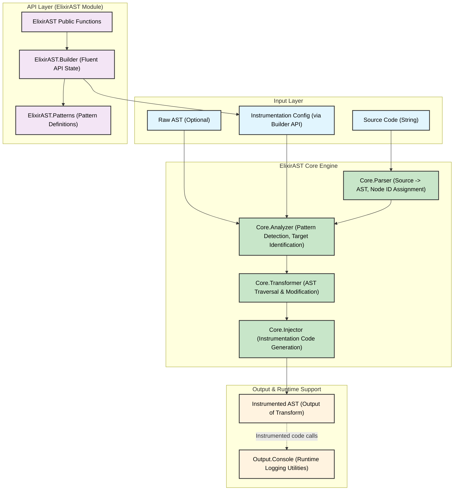
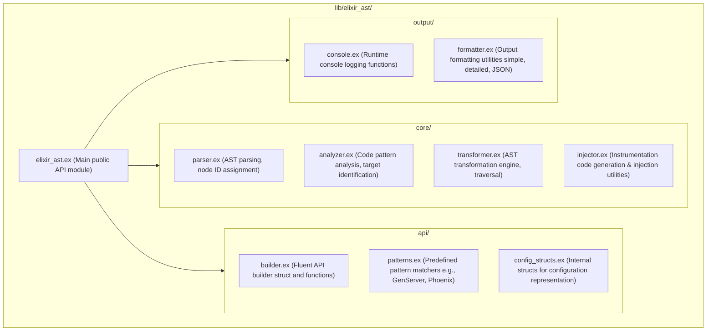
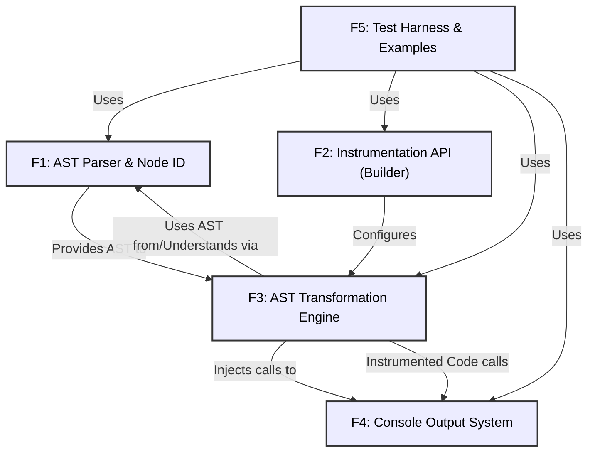

Okay, I will regenerate all the specified code and test files based on the `PRD_v3.md` document.

Here are the files:

**Project Configuration and Documentation Files:**

```text
=== .gitignore ===
/_build
/cover
/deps
/doc
/.fetch
erl_crash.dump
*.ez
*.beam
/config/*.secret.exs
.elixir_ls/

=== mix.exs ===
defmodule ElixirAST.MixProject do
  use Mix.Project

  def project do
    [
      app: :elixir_ast,
      version: "0.1.0",
      elixir: "~> 1.12", # As per PRD (though typically higher like 1.14+ for modern projects)
      start_permanent: Mix.env() == :prod,
      deps: deps(),
      # Optional: Add these for better docs and package info
      name: "ElixirAST",
      description: "Compile-Time AST Instrumentation Engine for Elixir.",
      source_url: "https://github.com/your_username/elixir_ast", # Replace with actual URL
      # homepage_url: "https://your_project_homepage.com", # Replace
      package: [
        maintainers: ["Your Name"], # Replace
        licenses: ["Apache-2.0"], # Or your chosen license
        links: %{"GitHub" => "https://github.com/your_username/elixir_ast"} # Replace
      ],
      docs: [
        main: "ElixirAST",
        extras: ["PRD_v3.md"] # If you want to include the PRD in hexdocs
      ]
    ]
  end

  # Run "mix help compile.app" to learn about applications.
  def application do
    [
      extra_applications: [:logger]
    ]
  end

  defp deps do
    [
      # No external dependencies for MVP core library beyond Elixir itself.
      # Add {:benchee, "~> 1.0", only: :dev} if you plan to run benchmarks from bench/
      # Add {:ex_doc, "~> 0.28", only: :dev, runtime: false} for documentation generation
    ]
  end
end

=== ARCH_DIAGS.md ===
# Architectural Diagrams for ElixirAST

## 1. Core Components



## 2. Module Structure



## 3. MVP Feature Interactions



=== ALGORITHMS.md ===
# ElixirAST Algorithm Explanations

## AST Parsing & Node ID Assignment (`ElixirAST.Core.Parser`)

This component is foundational to ElixirAST, responsible for transforming raw Elixir source code into a structured Abstract Syntax Tree (AST) and then annotating this tree with unique, stable, and deterministic identifiers for its nodes.

### 1. AST Parsing

The ElixirAST library begins its process by converting Elixir source code, provided as a string, into an Abstract Syntax Tree (AST). This is a fundamental step in understanding and manipulating the code's structure. Elixir provides built-in capabilities for this, notably the `Code.string_to_quoted/1` function.

When `Code.string_to_quoted/1` processes a string of Elixir code, it returns a quoted expression. This quoted expression is Elixir's representation of the code's AST. In Elixir, an AST is typically a nested structure of tuples, atoms, and basic data types. For example, a function definition `def my_func(a), do: a + 10` would be represented as a tuple like `{:def, context, [{:my_func, context, [{:a, context, nil}]}, [do: {:+, context, [{:a, context, nil}, 10]}]]}`. Each element in this structure (like `:def`, `:my_func`, `:+`, `:a`, `10`) is an AST node, providing a detailed, machine-readable blueprint of the original code.

### 2. Node ID Assignment

Once the AST is obtained, ElixirAST assigns unique, stable, and deterministic identifiers (Node IDs) to relevant nodes within this tree. This is crucial for several reasons:
*   **Precise Targeting:** Node IDs allow the instrumentation engine to pinpoint exactly where to apply transformations or inject code, even in complex or nested structures.
*   **Stability:** If the source code doesn't change significantly, the IDs for existing nodes should remain the same across different compilations, allowing for consistent behavior.
*   **Determinism:** The ID generation process must always produce the same ID for the same node given the same AST, ensuring reproducibility.

The `Core.Parser` module is responsible for this, likely through a function like `assign_node_ids/1`. This function would traverse the AST (commonly using a depth-first traversal algorithm) and, for each relevant node, generate and attach an ID. "Relevant AST nodes," as per the product requirements, include modules, function definitions (`def`, `defp`, etc.), and various expressions.

The ID itself is stored in the node's metadata, typically a keyword list accessible via `elem(node_ast, 2)` for 3-element tuple AST nodes. The PRD suggests using the key `:elixir_ast_node_id`.

Several strategies can be employed for generating these Node IDs:

*   **Path-based IDs:**
    *   **Concept:** An ID is constructed by concatenating information from the node's ancestors, forming a unique "path" from the root of the AST to the node. For example, an expression within a function might get an ID like `"MyModule:my_function/1:body:expr_3"`.
    *   **Pros:** Relatively straightforward to implement and understand. Can be quite stable if the overall structure of the code is maintained.
    *   **Cons:** IDs can become unstable if code is significantly restructured (e.g., a function is renamed, or a block of code is moved into a new nested structure). This could make it harder to maintain consistent instrumentation across such changes.

*   **Content-based Hashing:**
    *   **Concept:** A hash (e.g., SHA256) is generated based on the content or a canonical representation of the AST node itself (and potentially its children or key properties).
    *   **Pros:** Highly deterministic. IDs remain stable for a node as long as its own content doesn't change, even if it's moved within the AST.
    *   **Cons:** Can be computationally more intensive. Care must be taken to define what "content" is included in the hash to avoid unintended ID changes due to minor, semantically irrelevant variations (e.g., metadata changes not related to code structure). Potential for hash collisions, though unlikely with good hashing algorithms.

*   **Sequential Numbering during Traversal:**
    *   **Concept:** As the AST is traversed, nodes are assigned IDs like `"node_1"`, `"node_2"`, etc., in the order they are visited.
    *   **Pros:** Very simple to implement.
    *   **Cons:** Highly unstable. Any reordering of code, or even adding/removing unrelated code, can change the IDs of subsequent nodes, making it unsuitable for most practical instrumentation scenarios that require stability.

A robust implementation might use a hybrid approach or prioritize path-based IDs with careful consideration for stability factors. The key is that the chosen method must reliably produce unique, stable, and deterministic IDs for effective and consistent instrumentation.

## AST Transformation Engine & Code Injection (`ElixirAST.Core.Transformer` & `ElixirAST.Core.Injector`)

After the AST has been parsed and its nodes assigned unique IDs, the "AST Transformation Engine" comes into play. This engine is the heart of ElixirAST's instrumentation capabilities. It takes the ID-annotated AST and an "Instrumentation Configuration" object to produce a new, modified AST that includes the desired instrumentation logic (e.g., logging calls, variable captures).

### 1. Overview of the Transformation Process

*   **Inputs:**
    1.  **ID-Annotated AST:** The original source code's AST, enriched with unique node identifiers by the `ElixirAST.Core.Parser`.
    2.  **Instrumentation Configuration:** An object, typically built using `ElixirAST.Builder` (as per F2), that specifies what to instrument and how. This configuration details target nodes (e.g., specific functions or modules identified by their node IDs or patterns), the type of instrumentation (e.g., entry/exit logging, variable capture), and any custom code to be injected.

*   **Goal:** The primary goal is to produce a new Elixir AST. This new AST, when compiled and executed, will run the original code's logic *plus* the additional instrumentation behaviors defined in the configuration.

*   **Semantic Preservation:** A critical requirement is that the instrumentation process must not alter the original semantics or behavior of the code being instrumented. The injected code should be "transparent" in terms of the original program's execution flow and results, aside from the intended side-effects of instrumentation (like logging).

### 2. Role of Instrumentation Configuration

The Instrumentation Configuration, defined through the fluent API of `ElixirAST.Builder`, is the blueprint for the transformation process. It dictates:

*   **Targeting:** Which parts of the code to modify. This can be based on:
    *   Specific node IDs (e.g., instrument function with ID `MyModule:my_func/1`).
    *   Patterns (e.g., all public functions in a module, all GenServer callbacks).
    *   Code structure (e.g., before every return statement in a function).
*   **Actions:** What instrumentation to apply. This includes:
    *   Logging function entry/exit points.
    *   Capturing and logging the values of specific variables or expressions.
    *   Injecting custom Elixir code snippets provided by the user.
*   **Data:** What specific information to log (e.g., function arguments, return values, timestamps, custom messages).

The `Core.Transformer` consults this configuration extensively to determine if and how each node in the AST should be modified.

### 3. AST Traversal (`Core.Transformer`)

The `ElixirAST.Core.Transformer` module is responsible for navigating the ID-annotated AST and applying the transformations.

*   **Traversal Mechanism:** A depth-first traversal (e.g., using `Macro.prewalk/2` or `Macro.postwalk/2`) is a common and effective way to visit each node in the AST.
    *   `Macro.prewalk/2`: Processes a node *before* its children. Useful if transformations on a parent node might affect how children are processed or if the context of the parent is needed to decide on transforming children.
    *   `Macro.postwalk/2`: Processes a node *after* its children have been processed. Useful if transformations on children might alter the parent node, or if the results of child transformations are needed to correctly transform the parent.
    The choice (or combination) depends on the specific transformation being applied.

*   **Decision Making:** At each node visited, the `Transformer` checks the Instrumentation Configuration:
    *   Does the current node's ID (or its properties) match any targeting rules in the configuration?
    *   Are there any child-specific rules that apply if this is a structural node (like a function definition or a block)?
    *   Based on the matching rules, it determines what action (if any) the `Core.Injector` should take for this node.

### 4. Code Injection (`Core.Injector`)

The `ElixirAST.Core.Injector` module is responsible for generating the AST snippets for the instrumentation code and then inserting them into the main AST at the locations determined by the `Transformer`.

*   **Metaprogramming Power:** Elixir's powerful metaprogramming capabilities, particularly `quote`, `unquote`, and macros, are fundamental here.
    *   `quote`: Allows the creation of Elixir AST snippets directly within Elixir code. For example, `quote do: IO.puts("Hello")` generates the AST for an `IO.puts/1` call.
    *   `unquote`: Used within a `quote` block to inject existing variables or AST fragments into the generated AST. This is crucial for parameterizing the injected code (e.g., injecting a specific node ID or a variable name to be logged).
    *   Macros: Can be defined to encapsulate complex AST generation patterns, making the injector logic cleaner and more reusable.

*   **Conceptual Examples of Injection Types:**

    *   **Function Entry/Exit Logging:**
        *   **Concept:** To log entry, code is injected at the beginning of the function body. To log exit, code is injected before every return point (including implicit returns at the end of the body and explicit `return` calls if they were supported, though Elixir relies on the last expression's value).
        *   **Implementation:**
            The function's body (which is itself an AST, often a block like `{:__block__, [], [...]}`) is modified.
            For entry logging: `quote do: ElixirAST.Output.Console.log_entry(node_id, args_map); unquote(original_body_ast) end`
            For exit logging (simplified, actual implementation needs to handle multiple return paths and capture the return value):
            A common technique is to wrap the entire function body or transform its final expression. For instance, if `original_body_ast` is the function's body:
            `quote do
               result = begin unquote(original_body_ast) end
               ElixirAST.Output.Console.log_exit(node_id, result)
               result # Ensure the original return value is preserved
             end`
        *   **Argument/Return Value Capture:** Arguments can be captured by referencing their names (available in the AST context) within the `quote`d block for entry logging. Return values are captured by assigning the result of the original body to a temporary variable and then logging that variable, as shown above.

    *   **Variable Capture:**
        *   **Concept:** Injecting code to log a variable's value at a specific point.
        *   **Implementation:** If the target is an expression where `my_var` is in scope:
            `quote do
               logged_value = unquote(Macro.var(:my_var, nil)) # AST for the variable itself
               ElixirAST.Output.Console.log_variable(node_id, "my_var", logged_value)
               unquote(Macro.var(:my_var, nil)) # Ensure the original expression value (if this replaces an expression) is preserved
             end`
            If simply inserting a logging statement without replacing an expression, the last line (preserving the original expression) might not be needed, or the injection point would be carefully chosen (e.g., *after* an assignment).

    *   **Custom Code Injection:**
        *   **Concept:** Inserting user-provided, pre-quoted Elixir code at specified locations.
        *   **Implementation:** The `Transformer` identifies the target AST node. The `Injector` then splices the user's quoted code (which is already an AST) into the main AST.
            Example: Inserting `user_code_ast` before an `expression_ast`:
            `quote do
               unquote(user_code_ast)
               unquote(expression_ast)
             end`
        *   **Variable Scope (`context_vars`):** If the custom code needs access to variables from the instrumentation context (e.g., the value of `some_var` at the injection point), the `Injector` might need to explicitly prepare these variables, perhaps by creating a binding map or by ensuring the `quote` environment correctly captures them. This can be complex and requires careful handling of Elixir's hygiene rules for macros and quoted expressions.

*   **Maintaining Semantic Integrity:** This is paramount.
    *   **Expression Values:** If an expression `original_expr` is being logged, the injected code should often be `log(original_expr)` or, more robustly, `temp = original_expr; log(temp); temp`. This ensures that if `original_expr` was, for example, the condition of an `if` statement, logging it doesn't consume its value or change the control flow.
    *   **Blocks:** When injecting into a block (e.g., `do...end`), new statements are typically added to the list of expressions within the block. The order matters.
    *   **Side Effects:** Injected code should generally avoid introducing new side effects beyond the intended instrumentation (e.g., don't modify variables that the original code relies on, unless that's the specific purpose of a custom instrumentation).

### 5. Handling Edge Cases

Transforming Elixir AST is non-trivial due to the language's flexibility. The `Transformer` and `Injector` must be designed to handle (or at least be aware of) various complexities:

*   **Guards:** Function clauses can have guards (`when ...`). Instrumentation code must not interfere with guard evaluation.
*   **Multi-clause Functions:** Instrumentation might need to be applied to each clause consistently.
*   **Macros:** Macros are expanded by the Elixir compiler *before* ElixirAST typically gets the AST (if it operates on source code string). If ElixirAST operates on already expanded AST, it will see the generated code. If it aims to instrument code *before* macro expansion, that's a much harder problem. The current scope seems to be post-expansion AST.
*   **Complex Pattern Matching:** In function heads or `case` statements, pattern matching can be intricate. Injecting code around these constructs requires careful AST manipulation to preserve the matching logic.
*   **Pipelines (`|>`):** Transforming parts of a pipeline requires careful reconstruction of the pipeline or understanding how `|>` is represented in the AST (as nested function calls).

Acknowledging these complexities is important for robust design, even if full solutions for all are iterative.

### 6. Output

The final output of the `ElixirAST.Core.Transformer` is a new, instrumented AST. This AST represents the original program's logic, augmented with the instrumentation code as specified by the configuration. This new AST can then be:

*   Converted back to an Elixir code string (e.g., using `Macro.to_string/1`) for inspection or further processing.
*   Compiled and executed by the Elixir runtime.

When this instrumented AST is run, it will execute the original program logic along with the injected logging or custom actions, providing insights into the program's behavior.

## Pattern Detection (`ElixirAST.Core.Analyzer` & `ElixirAST.Patterns`)

While precise Node ID targeting is powerful, ElixirAST also offers a higher-level abstraction for instrumentation through pattern-based targeting. This allows users to specify common Elixir idioms or framework-specific constructs (like GenServer callbacks or Phoenix controller actions) without needing to know the exact Node IDs of every function involved.

### 1. Purpose of Pattern Detection

*   **User Convenience:** Simplifies the instrumentation setup for common use cases. Instead of manually identifying and listing Node IDs for all GenServer callbacks in a module, a user can simply specify `target_pattern(:genserver_callbacks)`.
*   **Abstraction:** Enables the creation of more generalized instrumentation strategies that apply to categories of code elements.
*   **Maintainability:** If the underlying code changes (e.g., a new GenServer callback is added), pattern-based targeting can automatically include it in the instrumentation scope, whereas ID-based targeting would require manual updates.

### 2. General Approach

Pattern detection is primarily handled by the `ElixirAST.Core.Analyzer` module, specifically its `detect_patterns/2` function. This function takes the ID-annotated AST and the user-supplied instrumentation configuration (which may include pattern targets) as input.

The `Core.Analyzer` collaborates with the `ElixirAST.Patterns` module, which is expected to contain definitions or logic for recognizing various code patterns. The process generally involves:

1.  **AST Traversal:** The `Core.Analyzer` traverses the AST (or relevant parts, such as module definitions and their contents).
2.  **Pattern Matching Logic:** For each pattern specified in the configuration (e.g., `:genserver_callbacks`), the analyzer applies specific matching logic. This logic is defined within or utilized by `ElixirAST.Patterns`.
3.  **Node ID Collection:** When a pattern is successfully matched to one or more AST nodes (e.g., specific function definitions), their Node IDs are collected.

### 3. Conceptual Strategies for Identifying Specific Patterns

The `ElixirAST.Patterns` module would encapsulate the logic for how each supported pattern is identified. Here are conceptual approaches:

*   **GenServer Callbacks (`:genserver_callbacks`):**
    *   **Module-Level Check:** The analyzer first looks for a `use GenServer` statement within the module's AST. This is a strong indicator that the module implements GenServer behaviors.
    *   **Function Identification:** If `use GenServer` is found, the analyzer then scans for function definitions (`:def` nodes) whose names and arities match standard GenServer callbacks:
        *   `init/1`
        *   `handle_call/3`
        *   `handle_cast/2`
        *   `handle_info/2`
        *   `terminate/2`
        *   `code_change/3`
    *   The Node IDs of these identified functions are then collected.

*   **Phoenix Controller Actions (`:phoenix_actions`):**
    *   **Module-Level Check:** Look for `use MyAppWeb, :controller` or `use Phoenix.Controller` (or similar conventional markers) in the module AST.
    *   **Function Identification:** Identify public function definitions (see below) that are conventionally used as controller actions. These often have an arity of 2 (e.g., `conn, params`). Common action names include:
        *   `index/2`
        *   `show/2`
        *   `new/2`
        *   `create/2`
        *   `edit/2`
        *   `update/2`
        *   `delete/2`
    *   Heuristics might be needed, as not all public functions with arity 2 in a controller are necessarily actions. However, for MVP, matching common names is a good starting point.

*   **Phoenix LiveView Callbacks:** (Similar to GenServer/Controller)
    *   **Module-Level Check:** Look for `use Phoenix.LiveView` or `use MyAppWeb, :live_view`.
    *   **Function Identification:** Identify callback functions like `mount/3`, `handle_params/3`, `handle_event/3`, `render/1`.

*   **Public/Private Functions (`:public_functions`, `:private_functions`):**
    *   **AST Node Type:** This is relatively straightforward. The analyzer inspects the type of the function definition node:
        *   `{:def, ...}` corresponds to a public function (`def`).
        *   `{:defp, ...}` corresponds to a private function (`defp`).
    *   This pattern can be applied across an entire module or selectively.

*   **Recursive Functions (`:recursive_functions`):**
    *   **Function Body Analysis:** For each function definition, the analyzer needs to traverse its body AST.
    *   **Self-Call Detection:** It looks for function call nodes within the body that invoke the function itself. This means the called function name and arity match the signature of the function being analyzed.
        *   Example: In `def fac(n) do ... fac(n-1) ... end`, the call `fac(n-1)` would be identified.
    *   **Scope Consideration:** Care must be taken to ensure the call is to the *same* function (e.g., not a different function with the same name/arity imported from another module). Node IDs or module context can help here.
    *   **Mutual Recursion:** Detecting mutual recursion (e.g., function A calls B, and B calls A) is significantly more complex and typically requires building a call graph. The PRD specifies "recursive functions," which usually implies direct recursion as a starting point.

### 4. Output of Pattern Detection

The primary output of the `detect_patterns/2` function (or the pattern detection process within the `Core.Analyzer`) is a refined set of target Node IDs. If a user specified `target_pattern(:genserver_callbacks)` for `MyModule`, the analyzer would resolve this to the actual Node IDs of `MyModule.init/1`, `MyModule.handle_call/3`, etc.

This list of resolved Node IDs is then used by the `ElixirAST.Core.Transformer`. The transformer doesn't need to know *why* a particular Node ID was selected (whether directly by the user or via a pattern). It simply receives a list of Node IDs and applies the specified instrumentation actions to them.

This separation of concerns (Analyzer identifies targets based on patterns, Transformer applies modifications) makes the system more modular and extensible. New patterns can be added to `ElixirAST.Patterns` and recognized by the `Core.Analyzer` without requiring changes to the core transformation logic.

=== bench/core_operations_bench.exs ===
defmodule ElixirAST.Bench.CoreOperations do
  @moduledoc """
  Benchmarks for ElixirAST core operations: AST parsing and transformation.
  These benchmarks aim to verify performance targets set in the PRD.

  To run these benchmarks:
  1. Add Benchee to your `mix.exs` dependencies: `{:benchee, "~> 1.0", only: :dev}`
  2. Run `mix deps.get`
  3. Execute from the project root: `mix run bench/core_operations_bench.exs`
     Or, in IEx: `c "bench/core_operations_bench.exs"; ElixirAST.Bench.CoreOperations.run()`
  """

  alias ElixirAST

  # --- Example Code Strings ---
  # Modules of varying sizes to test parsing and transformation.

  @small_module_source """
  defmodule ElixirAST.Bench.SmallMod do
    def hello(name), do: "Hello \#{name}"
    defp internal_greet(name, prefix), do: "\#{prefix} \#{name}"
    def full_greeting(name, prefix \\ "Hi"), do: internal_greet(name, prefix)
  end
  """

  @medium_module_source """
  defmodule ElixirAST.Bench.MediumMod do
    @moduledoc "A medium-sized module for benchmarking."
    defstruct [:name, :value, :items]

    def process(data) when is_list(data) do
      data
      |> Enum.map(&process_item/1)
      |> Enum.sum()
    end
    def process(data), do: process_item(data)

    defp process_item(%{value: v}) when is_integer(v), do: v * 2
    defp process_item(%{value: v}) when is_binary(v), do: String.length(v) + 10
    defp process_item(%{items: i}) when is_list(i), do: Enum.count(i)
    defp process_item(other) do
      # Simulate some work
      :timer.sleep(1)
      {:unhandled, other}
    end
    
    def complex_logic(a, b, c) do
      result =
        cond do
          a > b && b > c -> :gt
          a < b && b < c -> :lt
          a == b || b == c -> :eq
          is_number(a) && is_number(b) && is_number(c) -> :numbers
          true -> :other
        end

      case result do
        :gt -> handle_greater_than(a, b, c)
        :lt -> handle_less_than(a, b, c)
        :numbers -> a + b + c
        _ -> :default_case_result
      end
    end

    defp handle_greater_than(a,b,c), do: {a,b,c, :gt_handled, a * b - c}
    defp handle_less_than(a,b,c), do: {a,b,c, :lt_handled, c * b - a}

    def another_op(list) when is_list(list) do
      for x <- list, into: %{} do
        {x, x * x}
      end
    end
  end
  """ # Approx 30-40 LOC

  @large_module_source """
  defmodule ElixirAST.Bench.LargeMod do
    @moduledoc "A larger module for benchmarking, simulating more complex code."
    use Agent # Add a common 'use' statement

    def start_link(initial_state \\ %{}) do
      Agent.start_link(fn -> initial_state end, name: __MODULE__)
    end

    def get_state(), do: Agent.get(__MODULE__, & &1)
    def update_state(key, value), do: Agent.update(__MODULE__, &Map.put(&1, key, value))

    def func1(arg1), do: {:ok, arg1, :val1}
    def func1(arg1, arg2), do: {:ok, arg1, arg2, :val2}
    def func1(arg1, arg2, arg3), do: Enum.map([arg1,arg2,arg3], &(&1 * 2))

    defp p_func1(x), do: x * x + 1
    defp p_func2(x,y), do: x + y + p_func1(x) - p_func1(y)

    # Generate multiple functions
    for i <- 1..20 do
      def unquote(:"generated_fun_#{i}")(param) do
        # Add some complexity
        transformed_param = param |> to_string() |> String.reverse()
        result = unquote(i) + p_func2(param, unquote(i))
        {:ok, transformed_param, result, unquote(:"generated_meta_#{i}")}
      end

      defp unquote(:"private_generated_fun_#{i}")(p1, p2) do
        if rem(p1,2) == 0, do: p1 * p2, else: p1 + p2 + unquote(i)
      end
    end

    def another_func(a, b, c, d) do
      res = for x <- a..b, y <- c..d, x > y, into: [] do
        intermediate = p_func1(x-y)
        val = if intermediate > 100, do: intermediate * 0.9, else: intermediate * 1.1
        {x, y, val, private_generated_fun_1(x,y)} # Call one of the generated private funs
      end
      {:done, Enum.sum(for {_,_,v,_} <- res, do: v), res}
    end

    def yet_another(val) do
      try do
        case val do
          {:ok, data} when is_map(data) -> transform_data(data)
          {:ok, data} when is_list(data) -> Enum.map(data, &transform_data/1)
          {:error, reason} -> log_error(reason)
          _ -> :unknown_input_type
        end
      rescue
        e in [RuntimeError, ArgumentError] -> {:rescued, e.__struct__, e.message}
      catch
        :exit, reason -> {:exit_caught, reason}
        kind, value -> {:caught, kind, value}
      else
        transformed_data -> {:ok, :processed, transformed_data}
      end
    end

    defp transform_data(data) when is_map(data), do: Enum.into(data, %{}, fn {k,v} -> {Atom.to_string(k), v*2} end)
    defp transform_data(data) when is_integer(data), do: data + 100
    defp transform_data(data), do: data

    defp log_error(reason), do: {:logged_error, reason} # IO.inspect(reason, label: "Error")

    # Add a few more simple functions
    def f1(a), do: a
    def f2(a,b), do: {a,b}
    defp pf1(a), do: a
    defp pf2(a,b), do: {a,b}
  end
  """ # Aiming for ~100-150 LOC with generated functions

  def run do
    IO.puts("--- ElixirAST Core Operations Benchmarks ---")
    IO.puts("Ensure ElixirAST core functions (parse/1, transform/2) are implemented.")
    IO.puts("Results will show :not_implemented_for_prd if stubs are hit.\n")

    # Standard config for transformation benchmarks
    # This config aims to trigger a reasonable amount of transformation work.
    instrument_all_config =
      ElixirAST.new()
      |> ElixirAST.instrument_functions(:all, log_entry_exit: [capture_args: true, capture_return: true, log_duration: true])
      |> ElixirAST.capture_variables(:all, at: :entry)
      |> ElixirAST.capture_variables(:all, at: :before_return)
      |> ElixirAST.output_to(:console)
      |> ElixirAST.format(:detailed)

    # --- 1. AST Parsing (Source -> AST with Node IDs) ---
    # PRD Target: <10ms per module (for 300-500 LOC, adjust expectation for smaller modules)
    IO.puts("Benchmarking: AST Parsing (ElixirAST.parse/1)")
    Benchee.run(
      %{
        "Parse Small Module (~5 LOC)" => fn -> ElixirAST.parse(@small_module_source) end,
        "Parse Medium Module (~40 LOC)" => fn -> ElixirAST.parse(@medium_module_source) end,
        "Parse Large Module (~100+ LOC)" => fn -> ElixirAST.parse(@large_module_source) end
      },
      time: 2, # seconds for each job
      memory_time: 1, # seconds for memory measurement (if Benchee version supports it well)
      warmup: 1, # seconds
      # formatter: Benchee.Formatters.Console, # Default
      # print: [fast_warning: false], # Suppress warnings about fast execution for small inputs
      # TODO: Add comparison against PRD target once results are stable.
      #       e.g. check if average time < 10_000 (microseconds for 10ms)
    )

    # --- 2. Instrumentation Config API Calls ---
    # PRD Target: <1ms per call
    IO.puts("\nBenchmarking: Instrumentation Config Builder Calls (individual calls)")
    config_builder_fn = fn ->
        ElixirAST.new()
        |> ElixirAST.instrument_functions(:all, log_entry_exit: [capture_args: true])
        |> ElixirAST.capture_variables([:foo, :bar], at: :before_return)
        |> ElixirAST.target_pattern(:genserver_callbacks)
        |> ElixirAST.inject_at_line(10, quote(do: :ok))
        |> ElixirAST.format(:json)
        |> ElixirAST.output_to(:console)
    end

    Benchee.run(
      %{"Build Complex Config (6 calls)" => config_builder_fn},
      time: 2, warmup: 1
      # TODO: Divide average time by number of calls to estimate per-call time.
    )


    # --- 3. AST Transformation ---
    # PRD Target: <50ms per module (for 300-500 LOC, adjust expectation)
    # This requires parse to work correctly.
    IO.puts("\nBenchmarking: AST Transformation (ElixirAST.transform/2)")
    IO.puts("Note: Transformation benchmarks depend on a working ElixirAST.parse/1.")

    # Pre-parse ASTs to isolate transformation time
    # Handle potential :not_implemented_for_prd from parse stubs
    parsed_asts =
      Enum.into(
        [
          {"Small Module AST", @small_module_source},
          {"Medium Module AST", @medium_module_source},
          {"Large Module AST", @large_module_source}
        ],
        %{},
        fn {name, source} ->
          case ElixirAST.parse(source) do
            {:ok, ast} -> {name, ast}
            {:error, _} = err -> {name, err} # Store error to skip benchmark or report
          end
        end
      )

    transform_jobs =
      Enum.reduce(parsed_asts, %{}, fn {name, parse_result}, acc ->
        case parse_result do
          {:ok, ast} ->
            Map.put(acc, name, fn -> ElixirAST.transform(instrument_all_config, ast) end)
          {:error, reason} ->
            IO.puts("Skipping transformation benchmark for '#{name}' due to parse error: #{inspect(reason)}")
            acc
        end
      end)

    if map_size(transform_jobs) > 0 do
      Benchee.run(
        transform_jobs,
        time: 2, memory_time: 1, warmup: 1
      )
    else
      IO.puts("No ASTs successfully parsed, skipping transformation benchmarks.")
    end

    IO.puts("\n--- Other Performance Considerations (Manual/External Checks) ---")
    IO.puts("- Memory Usage (Lib during compilation): PRD Target <5MB")
    IO.puts("  (Requires external tooling like :observer.start() or OS utils during a mix compile run)")
    IO.puts("- Compilation Impact: PRD Target <20% overhead")
    IO.puts("  (Requires a sample project, instrumenting it, and comparing `mix compile` times)")
    IO.puts("-------------------------------------------------")
  end
end

# Ensure Benchee is available or handle its absence if run without it.
# This script is designed to be run with `mix run path/to/script.exs`
# or compiled and run within IEx.
# ElixirAST.Bench.CoreOperations.run()
```

**Core Library Files (`lib/`)**

```text
=== lib/elixir_ast.ex ===
defmodule ElixirAST do
  @moduledoc """
  ElixirAST: Compile-Time AST Instrumentation Engine
  
  A clean, minimal library for programmatic AST instrumentation in Elixir.
  Focuses solely on compile-time code transformation with console output.
  
  ## Basic Usage
  
      config = ElixirAST.new()
      |> ElixirAST.instrument_functions(:all, log_entry_exit: [capture_args: true])
      |> ElixirAST.capture_variables([:result], at: :before_return) # Corrected from PRD example
      
      source_code = "defmodule MyMod, do: (def my_fun(a), do: a * 2)"
      {:ok, instrumented_ast} = ElixirAST.parse_and_transform(config, source_code)

      # Or, if you already have an AST:
      # {:ok, ast} = ElixirAST.parse(source_code)
      # {:ok, instrumented_ast} = ElixirAST.transform(config, ast)
  
  """

  alias ElixirAST.Api.Builder
  alias ElixirAST.Core.Parser
  alias ElixirAST.Core.Transformer
  alias ElixirAST.Core.Analyzer

  # ============================================================================
  # Core Types
  # ============================================================================

  @typedoc "Abstract Syntax Tree node. Elixir's quoted expression format."
  @type ast_node() :: term()

  @typedoc "Unique identifier for an AST node after parsing. Typically a string."
  @type node_id() :: binary()

  @typedoc "Instrumentation configuration state, represented by the `ElixirAST.Api.Builder` struct."
  @type instrumentation_config() :: %ElixirAST.Api.Builder{}

  @typedoc "Result of an AST transformation."
  @type transformation_result() :: {:ok, ast_node()} | {:error, term()}

  @typedoc """
  Options for logging function entry/exit.
  - `capture_args`: `boolean()` - Whether to log function arguments on entry. Default `false`.
  - `capture_return`: `boolean()` - Whether to log function return value on exit. Default `false`.
  - `log_duration`: `boolean()` - Whether to log function execution duration. Default `false`.
  """
  @type log_entry_exit_opts() :: [
    capture_args: boolean(),
    capture_return: boolean(),
    log_duration: boolean()
  ]

  @typedoc """
  Options for capturing variables.
  - `at`: `:entry | :before_return | :on_error | {:line, pos_integer()}` - Where to capture. Default `:before_return`.
  """
  @type capture_variables_opts() :: [at: :entry | :before_return | :on_error | {:line, pos_integer()}]

  @typedoc """
  Options for tracking expressions.
  - `log_intermediate`: `boolean()` - Whether to log values before they are passed in a pipe. Default `false`.
  """
  @type track_expressions_opts() :: [log_intermediate: boolean()]

  @typedoc """
  Options for custom code injection.
  - `context_vars`: `[atom()]` - List of variables from the original scope to make available in the injected code.
  """
  @type injection_opts() :: [context_vars: [atom()]]

  # ============================================================================
  # Main API - Builder Pattern
  # ============================================================================

  @doc """
  Creates a new instrumentation configuration.
  
  ## Options
  - `output_target`: `atom()` - Where to send logs. Default `:console`. (Currently only `:console` is supported).
  - `output_format`: `atom()` - Log format. Default `:simple`. See `ElixirAST.format/2`.
  
  ## Examples
      config = ElixirAST.new()
      config = ElixirAST.new(output_target: :console, output_format: :json)
  """
  @spec new(keyword()) :: instrumentation_config()
  def new(opts \\ []) do
    Builder.new(opts)
  end

  @doc """
  Configures which functions to target for instrumentation.
  
  ## `target_spec` Options
  - `:all` - Instrument all functions (`def` and `defp`).
  - `:public` - Only public functions (`def`).
  - `:private` - Only private functions (`defp`).
  - `{:only, [atom() | {atom(), pos_integer()}]}` - Instrument only specified functions.
    Functions can be atoms (name only) or `{name, arity}` tuples.
  - `{:except, [atom() | {atom(), pos_integer()}]}` - Instrument all functions except specified ones.
  
  ## `instrumentation_opts` Options
  - `log_entry_exit`: `boolean() | log_entry_exit_opts()` - Log function entry and exit. 
    If `true`, uses default logging options. Provide a keyword list for custom options (see `log_entry_exit_opts()`). Default `false`.
  - `capture_variables`: `[atom()] | :all | {vars_spec, capture_variables_opts()}` - Capture local variables. 
    Provide a list of variable names, `:all`. To specify options like `:at`, use a tuple: `{[:var1, :var2], at: :entry}`.
    This differs slightly from PRD for clarity in `instrument_functions`. The separate `capture_variables/3` is preferred for complex captures.
    If only `capture_variables: [:var1]` is passed, it defaults to `at: :before_return`.
  
  ## Examples
      # Log entry/exit for all functions (default options)
      ElixirAST.new() |> ElixirAST.instrument_functions(:all, log_entry_exit: true)
      
      # Log entry/exit with args/return for public functions
      ElixirAST.new() 
      |> ElixirAST.instrument_functions(:public, log_entry_exit: [capture_args: true, capture_return: true])
      
      # Instrument only specific functions and capture :state variable (defaults to before_return)
      ElixirAST.new()  
      |> ElixirAST.instrument_functions({:only, [:handle_call, {:handle_cast, 2}]}, capture_variables: [:state])
  """
  @spec instrument_functions(instrumentation_config(), atom() | tuple(), keyword()) :: instrumentation_config()
  def instrument_functions(config, target_spec, instrumentation_opts \\ []) do
    Builder.instrument_functions(config, target_spec, instrumentation_opts)
  end

  @doc """
  Configures local variable capture for targeted functions.
  Variables are captured and logged. This function provides more control over capture points
  than the `capture_variables` option in `instrument_functions/3`.
  
  ## `variables`
  - `[atom()]`: A list of variable names (as atoms) to capture.
  - `:all`: Capture all local variables available in scope at the specified point.
  
  ## `opts` (`capture_variables_opts()`)
  - `:at`: Specifies when/where to capture variables.
    - `:entry`: At the beginning of the function.
    - `:before_return`: Just before the function returns (default).
    - `:on_error`: If an error is raised within the function (captures variables in scope at error time).
    - `{:line, number}`: After a specific line number's original code has executed.
  
  ## Examples
      # Capture :input and :result variables before function returns (default :at)
      ElixirAST.new() |> ElixirAST.capture_variables([:input, :result])
      
      # Capture all variables at function entry
      ElixirAST.new() |> ElixirAST.capture_variables(:all, at: :entry)
      
      # Capture variable :x after line 10
      ElixirAST.new() |> ElixirAST.capture_variables([:x], at: {:line, 10})
  """
  @spec capture_variables(instrumentation_config(), [atom()] | :all, capture_variables_opts()) :: instrumentation_config()
  def capture_variables(config, variables, opts \\ []) do
    Builder.capture_variables(config, variables, opts)
  end

  @doc """
  Configures tracking for specific expressions.
  The result of each specified expression will be logged.
  
  ## `expressions`
  - A list of quoted Elixir expressions to track. The expressions must be found literally in the code.
  
  ## `opts` (`track_expressions_opts()`)
  - `log_intermediate`: If `true`, for pipe operations (`|>`) that are part of the *tracked expression itself*, 
    logs the value before it's passed to the next function in that specific pipe. Default `false`.
    Note: This applies to the tracked expression, not all pipes in the function.
  
  ## Examples
      ElixirAST.new()
      |> ElixirAST.track_expressions([
        quote(do: user |> validate_user() |> save_user()), # Tracks final result of this specific pipe
        quote(do: complex_calculation(x, y) * discount_rate) # Tracks result of multiplication
      ])
      
      # Log intermediate results within the specified pipe expression
      ElixirAST.new()
      |> ElixirAST.track_expressions([quote(do: data |> process1() |> process2())], log_intermediate: true)
  """
  @spec track_expressions(instrumentation_config(), [ast_node()], track_expressions_opts()) :: instrumentation_config()
  def track_expressions(config, expressions, opts \\ []) do
    Builder.track_expressions(config, expressions, opts)
  end

  @doc """
  Injects custom quoted Elixir code at a specific line number.
  The injected code is executed *after* the original code corresponding to that line.
  
  ## `opts` (`injection_opts()`)
  - `context_vars`: A list of variable names (atoms) from the original code's scope
    that should be made available to the injected code. These variables will be bound
    with their runtime values when the injected code executes. Use with caution regarding variable shadowing and scope.
  
  ## Examples
      ElixirAST.new()
      |> ElixirAST.inject_at_line(42, quote(do: IO.puts("Debug: Checkpoint after line 42")))
      
      # Inject code that uses a variable 'user_id' from the original scope
      ElixirAST.new()
      |> ElixirAST.inject_at_line(10,
           quote(do: ElixirAST.Output.Console.log_event(%{type: :custom, message: "User ID at line 10", value: user_id})), # Assuming log_event or similar
           context_vars: [:user_id]
         )
  """
  @spec inject_at_line(instrumentation_config(), pos_integer(), ast_node(), injection_opts()) :: instrumentation_config()
  def inject_at_line(config, line_number, code, opts \\ []) do
    Builder.inject_at_line(config, line_number, code, opts)
  end

  @doc """
  Injects custom quoted Elixir code immediately before function return statements.
  The injected code has access to a special `result` variable containing the function's (prospective) return value.
  
  ## `opts` (`injection_opts()`)
  - `context_vars`: A list of variable names (atoms) from the original function's scope
    to make available to the injected code, in addition to `result`.
  
  ## Examples
      # Log the return value
      ElixirAST.new()
      |> ElixirAST.inject_before_return(quote(do: ElixirAST.Output.Console.log_event(%{type: :custom, message: "Function result", value: result})))
      
      # Log return value and a variable 'current_state' from function scope
      ElixirAST.new()
      |> ElixirAST.inject_before_return(
           quote(do: ElixirAST.Output.Console.log_event(%{type: :custom, message: "Final state", data: %{result: result, state: current_state}})),
           context_vars: [:current_state] # 'result' is implicitly available
         )
  """
  @spec inject_before_return(instrumentation_config(), ast_node(), injection_opts()) :: instrumentation_config()
  def inject_before_return(config, code, opts \\ []) do
    Builder.inject_before_return(config, code, opts)
  end

  @doc """
  Injects custom quoted Elixir code to be executed when an error is raised and not rescued within a targeted function.
  The injected code has access to `error` (the kind of error, e.g., `RuntimeError`), `reason` (the error term/message),
  and `stacktrace`.
  
  ## `opts` (`injection_opts()`)
  - `context_vars`: A list of variable names (atoms) from the original function's scope (at the point of error)
    to make available to the injected code.
  
  ## Examples
      ElixirAST.new()
      |> ElixirAST.inject_on_error(
           quote(do: ElixirAST.Output.Console.log_event(%{
             type: :custom_error, 
             message: "Error caught in function", 
             error: error, 
             reason: reason, 
             stacktrace: stacktrace
           }))
         )
  """
  @spec inject_on_error(instrumentation_config(), ast_node(), injection_opts()) :: instrumentation_config()
  def inject_on_error(config, code, opts \\ []) do
    Builder.inject_on_error(config, code, opts)
  end

  @doc """
  Configures instrumentation to target functions matching a predefined pattern.
  Subsequent instrumentation rules (like those from `instrument_functions`, `capture_variables`, etc.,
  if they are pattern-aware or if this filters the functions considered by them) 
  will be applied only to functions matching this pattern.
  
  ## Built-in Patterns
  - `:genserver_callbacks`: Targets `init/1`, `handle_call/3`, `handle_cast/2`, `handle_info/2`, `terminate/2`, `code_change/3`.
  - `:phoenix_actions`: Targets common Phoenix controller action names (e.g., `index/2`, `show/2`, `create/2`). Must be public.
  - `:phoenix_live_view_callbacks`: Targets `mount/3`, `handle_params/3`, `handle_event/3`, `handle_info/2`, `render/1`.
  - `:public_functions`: Targets all `def` functions.
  - `:private_functions`: Targets all `defp` functions.
  - `:recursive_functions`: Targets functions that directly call themselves (simple direct recursion).
  
  ## Examples
      # Instrument all GenServer callbacks
      ElixirAST.new()
      |> ElixirAST.target_pattern(:genserver_callbacks)
      # The following instrument_functions applies only to GenServer callbacks found
      |> ElixirAST.instrument_functions(:all, log_entry_exit: [capture_args: true]) 
      
      # Capture variables only in Phoenix controller actions
      ElixirAST.new()
      |> ElixirAST.target_pattern(:phoenix_actions)
      |> ElixirAST.capture_variables([:conn, :params], at: :entry)
  """
  @spec target_pattern(instrumentation_config(), atom()) :: instrumentation_config()
  def target_pattern(config, pattern_name) do
    Builder.target_pattern(config, pattern_name)
  end

  @doc """
  Configures the output target for instrumentation logs.
  Currently, only `:console` is supported for the MVP.
  
  ## Examples
      ElixirAST.new() |> ElixirAST.output_to(:console)
  """
  @spec output_to(instrumentation_config(), :console) :: instrumentation_config()
  def output_to(config, target) when target == :console do
    Builder.output_to(config, target)
  end

  @doc """
  Configures the output format for console logs.
  
  ## Format Types
  - `:simple`: Basic, human-readable text output. (Default)
    Example: `[ENTRY] MyModule.my_func/1 ARGS: [42]`
  - `:detailed`: More verbose output, including timestamps, PIDs.
    Example: `[2024-05-27T10:00:00.123Z <0.123.0> ENTRY] MyModule.my_func/1 ARGS: [42]`
  - `:json`: Machine-readable JSON output, one JSON object per line.
    Example: `{"timestamp": "...", "pid": "...", "type": "entry", "module": "MyModule", ...}`
  
  ## Examples
      ElixirAST.new() |> ElixirAST.format(:json)
  """
  @spec format(instrumentation_config(), :simple | :detailed | :json) :: instrumentation_config()
  def format(config, format_type) when format_type in [:simple, :detailed, :json] do
    Builder.format(config, format_type)
  end

  # ============================================================================
  # Transformation API
  # ============================================================================

  @doc """
  Transforms a given AST node (typically a module AST) based on the 
  provided instrumentation configuration. This is the main function to apply instrumentation.
  
  ## Examples
      {:ok, ast} = ElixirAST.parse(source_code)
      config = ElixirAST.new() |> ElixirAST.instrument_functions(:all)
      {:ok, instrumented_ast} = ElixirAST.transform(config, ast)
  """
  @spec transform(instrumentation_config(), ast_node()) :: transformation_result()
  def transform(config, ast) do
    Transformer.transform(config, ast)
  end

  @doc """
  Parses Elixir source code into an AST and assigns unique node IDs.
  Node IDs are essential for some advanced instrumentation targeting (e.g., specific expressions or lines if IDs are stable and predictable).
  The stability and granularity of node IDs depend on the `ElixirAST.Core.Parser` implementation.
  
  ## Examples
      source = "defmodule M do def hello(name), do: IO.puts('Hello ' <> name) end"
      {:ok, ast_with_node_ids} = ElixirAST.parse(source)
  """
  @spec parse(binary()) :: {:ok, ast_node()} | {:error, term()}
  def parse(source_code) when is_binary(source_code) do
    Parser.parse(source_code)
  end

  @doc """
  A convenience function that combines parsing source code (string) and transforming the resulting AST.
  
  ## Examples
      config = ElixirAST.new() |> ElixirAST.instrument_functions(:all)
      source_code = "defmodule M, do: (def my_fun, do: :ok)"
      {:ok, instrumented_ast} = ElixirAST.parse_and_transform(config, source_code)
  """
  @spec parse_and_transform(instrumentation_config(), binary()) :: transformation_result()
  def parse_and_transform(config, source_code) do
    with {:ok, ast} <- parse(source_code),
         :ok <- validate(config), # Optionally validate config before transform
         {:ok, instrumented_ast} <- transform(config, ast) do
      {:ok, instrumented_ast}
    else
      {:error, reasons} when is_list(reasons) -> {:error, {:config_validation, reasons}} # from validate
      {:error, _reason} = error -> error # from parse or transform
    end
  end

  # ============================================================================
  # Utility Functions
  # ============================================================================

  @doc """
  Analyzes an AST to identify instrumentable components and patterns.
  Returns a map containing information like function definitions (name, arity, type, line), 
  detected patterns (e.g., if it looks like a GenServer), AST node count, and a 
  conceptual complexity estimate.
  This can be useful for deciding how to configure instrumentation without transforming.
  
  ## Examples
      {:ok, ast} = ElixirAST.parse(source_code)
      analysis_report = ElixirAST.analyze(ast)
      # Example structure:
      # %{
      #   functions: [%{name: :hello, arity: 1, line: 1, type: :def, node_id: "..."}],
      #   patterns_detected: [:simple_function_module], # e.g. :genserver_module
      #   node_count: 15, 
      #   complexity_estimate: :low # e.g. :low, :medium, :high
      # }
  """
  @spec analyze(ast_node()) :: map()
  def analyze(ast) do
    Analyzer.analyze(ast)
  end

  @doc """
  Generates a preview of the instrumentation that would be applied
  based on the configuration and a given AST, without actually transforming the AST.
  Returns a map detailing the instrumentation points and actions. This helps verify
  if the configuration targets the intended code sections.
  
  ## Examples
      config = ElixirAST.new() |> ElixirAST.instrument_functions(:all)
      {:ok, ast} = ElixirAST.parse(source_code)
      instrumentation_preview = ElixirAST.preview(config, ast)
      # Example structure:
      # %{
      #   targets: [
      #     %{
      #       node_id: "...", 
      #       type: :function, 
      #       name: :my_func, 
      #       arity: 1,
      #       actions: [
      #         %{type: :log_entry, options: [...]},
      #         %{type: :log_exit, options: [...]},
      #         %{type: :capture_variable, var_name: :x, at: :entry},
      #         %{type: :inject_code, at: {:line, 5}, code_sha: "..."}
      #       ]
      #     }
      #   ],
      #   summary: %{functions_targeted: 1, injections: 2, captures: 1}
      # }
  """
  @spec preview(instrumentation_config(), ast_node()) :: map()
  def preview(config, ast) do
    # Note: Transformer.preview is not explicitly in PRD stubs but implied for this fn.
    # It would use much of the same logic as transform but collect actions instead of applying.
    Transformer.preview(config, ast)
  end

  @doc """
  Validates the provided instrumentation configuration.
  Checks for known incompatibilities or errors in the configuration options.
  Returns `:ok` if the configuration is valid, or `{:error, reasons :: list(term())}` otherwise.
  
  ## Examples
      config = ElixirAST.new() 
               |> ElixirAST.instrument_functions(:invalid_target_spec_atom) # Invalid
      case ElixirAST.validate(config) do
        :ok -> IO.puts("Config is valid.")
        {:error, reasons} -> IO.inspect(reasons, label: "Invalid config")
      end
  """
  @spec validate(instrumentation_config()) :: :ok | {:error, [term()]}
  def validate(config) do
    Builder.validate(config)
  end

  # ============================================================================
  # Convenience Functions
  # ============================================================================

  @doc """
  A quick way to instrument all functions in a source string for entry/exit logging
  and optionally capture specified variables. Output goes to the console.
  
  ## `opts`
  - `capture_vars`: `[atom()] | :all` - Variables to capture. Defaults to `[]`. Captured `at: :before_return`.
  - `log_args`: `boolean()` - Log function arguments on entry. Default `true`.
  - `log_return`: `boolean()` - Log function return value on exit. Default `true`.
  - `log_duration`: `boolean()` - Log function execution duration. Default `false`.
  - `format`: `:simple | :detailed | :json` - Output format. Default `:simple`.
  
  ## Examples
      # Instrument all functions with entry/exit logging
      {:ok, ast} = ElixirAST.quick_instrument(source_code)
      
      # Instrument and capture specific variables, log duration, use detailed format
      {:ok, ast} = ElixirAST.quick_instrument(source_code, 
        capture_vars: [:result, :user_state], 
        log_duration: true,
        format: :detailed
      )
  """
  @spec quick_instrument(binary(), keyword()) :: transformation_result()
  def quick_instrument(source_code, opts \\ []) do
    log_entry_exit_opts = [
      capture_args: Keyword.get(opts, :log_args, true),
      capture_return: Keyword.get(opts, :log_return, true),
      log_duration: Keyword.get(opts, :log_duration, false)
    ]
    
    vars_to_capture = Keyword.get(opts, :capture_vars, [])

    config = new(output_format: Keyword.get(opts, :format, :simple))
    |> instrument_functions(:all, log_entry_exit: log_entry_exit_opts)
    |> (fn c -> if vars_to_capture != [], do: capture_variables(c, vars_to_capture, at: :before_return), else: c end).()
    |> output_to(:console)
    
    parse_and_transform(config, source_code)
  end

  @doc """
  Convenience function to instrument common GenServer callbacks (`init/1`, `handle_call/3`, etc.).
  Logs entry/exit and captures common state-related variables by default.
  
  ## `opts`
  - `capture_vars`: `[atom()] | :all` - Variables to capture in addition to/instead of defaults. 
    Defaults try to capture `state`, `new_state`, `msg`, `from`, `reason`, `value` at entry and before return where applicable.
  - `log_entry_exit`: `log_entry_exit_opts()` - Override default entry/exit logging. 
    Default: `[capture_args: true, capture_return: true, log_duration: true]`.
  - `format`: `:simple | :detailed | :json` - Output format. Default `:detailed`.
  
  ## Examples
      {:ok, ast} = ElixirAST.instrument_genserver(genserver_source_code)
      
      {:ok, ast} = ElixirAST.instrument_genserver(genserver_source_code, capture_vars: [:state, :msg, :from])
  """
  @spec instrument_genserver(binary(), keyword()) :: transformation_result()
  def instrument_genserver(source_code, opts \\ []) do
    default_genserver_vars = [:state, :new_state, :msg, :from, :reason, :value, :socket, :reply, :params, :name, :mfa, :hibernate_after, :timeout, :server_name, :server, :request_id]
    vars_to_capture = Keyword.get(opts, :capture_vars, default_genserver_vars)

    log_entry_exit_opts = Keyword.get(opts, :log_entry_exit, [capture_args: true, capture_return: true, log_duration: true])

    config = new(output_format: Keyword.get(opts, :format, :detailed))
    |> target_pattern(:genserver_callbacks)
    |> instrument_functions(:all, log_entry_exit: log_entry_exit_opts)
    |> capture_variables(vars_to_capture, at: :before_return) 
    |> capture_variables(vars_to_capture, at: :entry)
    |> output_to(:console)
    
    parse_and_transform(config, source_code)
  end

  @doc """
  Convenience function to instrument Phoenix controller actions.
  Logs entry/exit and captures `conn` and `params` variables by default.
  
  ## `opts`
  - `capture_vars`: `[atom()] | :all` - Variables to capture. Default `[:conn, :params]` (captured at entry).
  - `log_entry_exit`: `log_entry_exit_opts()` - Override default entry/exit logging. 
    Default: `[capture_args: true, capture_return: false, log_duration: true]` (return often `conn`, can be large).
  - `format`: `:simple | :detailed | :json` - Output format. Default `:detailed`.
  
  ## Examples
      {:ok, ast} = ElixirAST.instrument_phoenix_controller(controller_source_code)
  """
  @spec instrument_phoenix_controller(binary(), keyword()) :: transformation_result()
  def instrument_phoenix_controller(source_code, opts \\ []) do
    vars_to_capture = Keyword.get(opts, :capture_vars, [:conn, :params])
    log_entry_exit_opts = Keyword.get(opts, :log_entry_exit, [capture_args: true, capture_return: false, log_duration: true])

    config = new(output_format: Keyword.get(opts, :format, :detailed))
    |> target_pattern(:phoenix_actions)
    |> instrument_functions(:all, log_entry_exit: log_entry_exit_opts)
    |> capture_variables(vars_to_capture, at: :entry)
    |> output_to(:console)
    
    parse_and_transform(config, source_code)
  end
end

=== lib/elixir_ast/api/builder.ex ===
defmodule ElixirAST.Api.Builder do
  @moduledoc """
  Internal. Fluent API builder for ElixirAST instrumentation configuration.
  This module holds the state of the configuration being built and provides
  functions to update this state. The main `ElixirAST` module delegates to this.
  """

  alias ElixirAST # For types

  @type t() :: %__MODULE__{}
  @type log_entry_exit_opts() :: ElixirAST.log_entry_exit_opts()
  @type capture_variables_opts() :: ElixirAST.capture_variables_opts()
  @type track_expressions_opts() :: ElixirAST.track_expressions_opts()
  @type injection_opts() :: ElixirAST.injection_opts()
  @type ast_node() :: ElixirAST.ast_node()

  # Based on PRD_v3.md, section "Supporting Modules"
  defstruct [
    # Function targeting
    function_target_spec: {:instrument, :all}, # {:instrument | :skip, :all | :public | :private | {:only, list} | {:except, list}}
    pattern_targets: [], # list of pattern atoms like :genserver_callbacks. These refine function_target_spec or are used by Analyzer.

    # Instrumentation actions for targeted functions
    log_function_entry_exit_opts: nil, # log_entry_exit_opts() or boolean | nil. If nil, no explicit entry/exit logging.
                                       # Set by instrument_functions/3's :log_entry_exit option.

    variables_to_capture: %{}, # %{capture_point_atom => [vars_to_capture_list_or_all_atom]}
                               # capture_point_atom e.g. :entry, :before_return, {:line, num}, :on_error
                               # Populated by capture_variables/3 and instrument_functions/3's :capture_variables option.

    expressions_to_track: [], # list of {quoted_expression, track_expressions_opts()}
                              # Populated by track_expressions/3.

    custom_injections: %{}, # %{injection_point_atom => [{quoted_code, injection_opts()}]}
                            # injection_point_atom e.g. {:at_line, N}, :before_return, :on_error
                            # Populated by inject_at_line/4, inject_before_return/3, inject_on_error/3.

    # Output configuration
    output_target: :console, # :console
    output_format: :simple,  # :simple | :detailed | :json
    verbose_mode: false      # General flag, perhaps for more detailed internal logging of ElixirAST itself. Not used by console output formatting directly.
  ]

  @spec new(keyword()) :: t()
  def new(opts \\ []) do
    %__MODULE__{
      output_target: Keyword.get(opts, :output_target, :console),
      output_format: Keyword.get(opts, :output_format, :simple),
      verbose_mode: Keyword.get(opts, :verbose_mode, false),
      # Explicitly initialize complex fields to empty, overriding defstruct defaults if they differ.
      function_target_spec: {:instrument, :all}, # Explicit default
      pattern_targets: [],
      log_function_entry_exit_opts: nil,
      variables_to_capture: %{},
      expressions_to_track: [],
      custom_injections: %{}
    }
  end

  @spec instrument_functions(t(), atom() | tuple(), keyword()) :: t()
  def instrument_functions(config, target_spec, instrumentation_opts \\ []) do
    log_opts = Keyword.get(instrumentation_opts, :log_entry_exit) # Can be boolean or keyword
    vars_to_capture_config = Keyword.get(instrumentation_opts, :capture_variables)

    config = %{config | 
      function_target_spec: {:instrument, target_spec}, # Assuming instrument for now
      log_function_entry_exit_opts: log_opts || config.log_function_entry_exit_opts # Merge or override
    }

    # Handle :capture_variables option from instrument_functions
    # This is a simplified way to add variable capture; capture_variables/3 is more explicit.
    case vars_to_capture_config do
      nil ->
        config
      vars_spec when is_list(vars_spec) or vars_spec == :all ->
        # Default to :before_return if only var list/atom is given
        capture_variables(config, vars_spec, at: :before_return)
      {vars_spec, opts} when is_list(vars_spec) or vars_spec == :all ->
        capture_variables(config, vars_spec, opts)
      _ ->
        # Invalid format for capture_variables in instrument_functions, could warn or error in validate
        config
    end
  end

  @spec capture_variables(t(), [atom()] | :all, capture_variables_opts()) :: t()
  def capture_variables(config, variables_spec, opts \\ []) do
    capture_point = Keyword.get(opts, :at, :before_return) # Default capture point

    existing_for_point = Map.get(config.variables_to_capture, capture_point, [])
    
    # Simple merge: append. More sophisticated merging (e.g. handling :all) might be needed.
    # If variables_spec is :all, it might override or combine with existing.
    # For now, just storing. Analyzer/Transformer will interpret.
    # This assumes variables_spec is a list or :all.
    # If existing_for_point already has :all, adding specific vars might be redundant or need clarification.
    new_vars_for_point = 
      case {variables_spec, existing_for_point} do
        (:all, _) -> [:all] # If :all is specified, it might imply all, overriding previous specifics for this point.
        (list, old_list) when is_list(list) -> Enum.uniq(list ++ List.wrap(old_list))
        (_, _) -> # Should not happen if types are correct
          existing_for_point 
      end
      
    new_captures = Map.put(config.variables_to_capture, capture_point, new_vars_for_point)
    %{config | variables_to_capture: new_captures}
  end

  @spec track_expressions(t(), [ast_node()], track_expressions_opts()) :: t()
  def track_expressions(config, expressions, opts \\ []) when is_list(expressions) do
    new_tracking_entries = Enum.map(expressions, fn expr_ast -> {expr_ast, opts} end)
    %{config | expressions_to_track: config.expressions_to_track ++ new_tracking_entries}
  end

  @spec inject_at_line(t(), pos_integer(), ast_node(), injection_opts()) :: t()
  def inject_at_line(config, line_number, code_ast, opts \\ []) do
    injection_point = {:at_line, line_number}
    existing_injections = Map.get(config.custom_injections, injection_point, [])
    new_injections = Map.put(config.custom_injections, injection_point, existing_injections ++ [{code_ast, opts}])
    %{config | custom_injections: new_injections}
  end

  @spec inject_before_return(t(), ast_node(), injection_opts()) :: t()
  def inject_before_return(config, code_ast, opts \\ []) do
    injection_point = :before_return
    existing_injections = Map.get(config.custom_injections, injection_point, [])
    new_injections = Map.put(config.custom_injections, injection_point, existing_injections ++ [{code_ast, opts}])
    %{config | custom_injections: new_injections}
  end

  @spec inject_on_error(t(), ast_node(), injection_opts()) :: t()
  def inject_on_error(config, code_ast, opts \\ []) do
    injection_point = :on_error
    existing_injections = Map.get(config.custom_injections, injection_point, [])
    new_injections = Map.put(config.custom_injections, injection_point, existing_injections ++ [{code_ast, opts}])
    %{config | custom_injections: new_injections}
  end

  @spec target_pattern(t(), atom()) :: t()
  def target_pattern(config, pattern_name) when is_atom(pattern_name) do
    # Appends pattern. The Analyzer will use these to resolve target functions.
    %{config | pattern_targets: Enum.uniq([pattern_name | config.pattern_targets])}
  end

  @spec output_to(t(), :console) :: t()
  def output_to(config, target) when target == :console do
    %{config | output_target: target}
  end

  @spec format(t(), :simple | :detailed | :json) :: t()
  def format(config, format_type) when format_type in [:simple, :detailed, :json] do
    %{config | output_format: format_type}
  end

  @spec validate(t()) :: :ok | {:error, [term()]}
  def validate(_config) do
    # Placeholder for actual validation logic.
    # This should check all fields of the config struct for validity and consistency.
    # For example:
    # - function_target_spec format
    # - pattern_targets are known patterns
    # - opts for various actions are correctly formatted (e.g., keywords with known keys/types)
    # - line numbers are positive integers
    # - etc.
    :ok # Default to :ok for MVP if detailed validation is not yet implemented.
  end
end

=== lib/elixir_ast/api/config_structs.ex ===
defmodule ElixirAST.Api.ConfigStructs do
  @moduledoc """
  Internal. Defines any supporting structs for ElixirAST configuration.

  For the MVP, the primary configuration state is held within the `ElixirAST.Api.Builder`
  struct itself. This module is a placeholder for more complex or refined
  configuration structs that might be factored out as the library evolves.

  For example, if specific instrumentation actions (like variable capture or
  custom injections) had many complex options, their configurations could be
  defined as separate structs here and embedded within the main `Builder` struct.
  """

  # No specific structs are defined here for the MVP, as `ElixirAST.Api.Builder`
  # holds the comprehensive configuration.
end

=== lib/elixir_ast/api/patterns.ex ===
defmodule ElixirAST.Api.Patterns do
  @moduledoc """
  Internal. Defines and provides matching logic for common Elixir code patterns.
  This module is used by `ElixirAST.Core.Analyzer` to identify functions
  targeted by pattern specifications (e.g., `:genserver_callbacks`).
  
  The functions here typically take an AST node (usually a function definition or a module)
  and return a boolean or metadata if the pattern matches.
  """

  alias ElixirAST.ast_node # For type hints if needed

  # Placeholder: Actual implementation would involve detailed AST inspection.

  @doc """
  Checks if a given function AST node matches a GenServer callback signature.
  This is a simplified check based on name and arity. A more robust check
  might also consider the module context (e.g., if `use GenServer` is present).
  """
  @spec match_genserver_callback?(ast_node()) :: boolean()
  def match_genserver_callback?({:def, _meta, [{name, _m, args} | _body]}) when is_list(args) do
    arity = length(args)
    case {name, arity} do
      {:init, 1} -> true
      {:handle_call, 3} -> true
      {:handle_cast, 2} -> true
      {:handle_info, 2} -> true
      {:terminate, 2} -> true
      {:code_change, 3} -> true
      _ -> false
    end
  end
  def match_genserver_callback?(_ast_node), do: false

  @doc """
  Checks if a given function AST node matches a common Phoenix controller action signature.
  Simplified check: public function with arity 2 and a common action name.
  """
  @spec match_phoenix_action?(ast_node()) :: boolean()
  def match_phoenix_action?({:def, _meta, [{name, _m, args} | _body]}) when is_list(args) do
    arity = length(args)
    common_actions = [:index, :show, :new, :create, :edit, :update, :delete]
    
    if arity == 2 && name in common_actions, do: true, else: false
  end
  def match_phoenix_action?(_ast_node), do: false
  
  @doc """
  Checks if a given function AST node matches a common Phoenix LiveView callback.
  """
  @spec match_phoenix_live_view_callback?(ast_node()) :: boolean()
  def match_phoenix_live_view_callback?({:def, _meta, [{name, _m, args} | _body]}) when is_list(args) do
    arity = length(args)
    case {name, arity} do
      {:mount, 3} -> true
      {:handle_params, 3} -> true
      {:handle_event, 3} -> true
      {:handle_info, 2} -> true
      {:render, 1} -> true
      # Other LV callbacks like terminate/2, handle_call/3, etc. could be added
      _ -> false
    end
  end
  def match_phoenix_live_view_callback?(_ast_node), do: false

  @doc """
  Checks if a given function AST node is a public function (`def`).
  """
  @spec match_public_function?(ast_node()) :: boolean()
  def match_public_function?({:def, _, _}), do: true
  def match_public_function?(_), do: false

  @doc """
  Checks if a given function AST node is a private function (`defp`).
  """
  @spec match_private_function?(ast_node()) :: boolean()
  def match_private_function?({:defp, _, _}), do: true
  def match_private_function?(_), do: false

  @doc """
  Checks if a given function AST node is (simply) recursive.
  This is a naive check for direct self-calls. Does not handle mutual recursion.
  Requires traversing the function body.
  """
  @spec match_recursive_function?(ast_node()) :: boolean()
  def match_recursive_function?({access_spec, _meta, [{name, _, args_params} | _body_clauses]}) 
    when access_spec in [:def, :defp] do
    # Placeholder: Actual implementation needs to traverse body_clauses
    # and look for calls to {name, arity}. This is complex.
    # For MVP, this might always return false or a very simple check.
    _function_name = name
    _arity = length(args_params)
    # IO.puts "Checking for recursion in #{name}/#{arity} - Not implemented yet"
    false # Placeholder
  end
  def match_recursive_function?(_), do: false

end

=== lib/elixir_ast/core/parser.ex ===
defmodule ElixirAST.Core.Parser do
  @moduledoc """
  Internal. Responsible for parsing Elixir source code into an Abstract Syntax Tree (AST)
  and assigning unique, stable, and deterministic node identifiers to relevant AST nodes.
  """

  alias ElixirAST.ast_node # For type hints

  @doc """
  Parses an Elixir source code string into an AST.
  If successful, then calls `assign_node_ids/1` to annotate the AST.
  """
  @spec parse(binary()) :: {:ok, ast_node()} | {:error, term()}
  def parse(source_code) when is_binary(source_code) do
    case Code.string_to_quoted(source_code) do
      {:ok, ast} ->
        # TODO: Implement robust node ID assignment. For MVP, it might be very basic.
        # The PRD stub just adds one ID to the top-level.
        # A real implementation needs to traverse and assign to many nodes.
        {:ok, assign_node_ids(ast)} 
      {:error, _reason} = error ->
        # Example: {:error, {1, Code.LexicalError, "invalid token: <<0>>"}}
        error
    end
  end
  
  @doc """
  Traverses an AST and assigns unique, stable, and deterministic node IDs
  to relevant AST nodes. The ID is stored in the node's metadata list
  under the key `:elixir_ast_node_id`.

  This is a placeholder implementation. A robust solution requires careful
  traversal and a chosen ID generation strategy (path-based, content-hashing, etc.).
  """
  @spec assign_node_ids(ast_node()) :: ast_node()
  def assign_node_ids(ast) do
    # Placeholder: Very basic "ID assignment" - just adds one to the top-level metadata.
    # A real implementation would traverse the AST (e.g., with Macro.prewalk/postwalk)
    # and assign IDs to many nodes based on a chosen strategy.
    # For example, a simple sequential ID for demonstration:
    {annotated_ast, _next_id} = assign_ids_recursive(ast, 0)
    annotated_ast
  end

  # Recursive helper for placeholder ID assignment
  defp assign_ids_recursive({tag, meta, children}, current_id) when isatom(tag) and is_list(meta) and is_list(children) do
    node_id_str = "node_#{current_id}"
    new_meta = Keyword.put(meta, :elixir_ast_node_id, node_id_str)
    
    {new_children, next_id_after_children} = 
      Enum.map_reduce(children, current_id + 1, fn child, acc_id ->
        assign_ids_recursive(child, acc_id)
      end)
      
    {{tag, new_meta, new_children}, next_id_after_children}
  end
  defp assign_ids_recursive({tag, meta, child_or_nil}, current_id) when isatom(tag) and is_list(meta) and not is_list(child_or_nil) do
    # Handles nodes like {name, meta, AtomModule | nil}
    node_id_str = "node_#{current_id}"
    new_meta = Keyword.put(meta, :elixir_ast_node_id, node_id_str)
    
    {new_child, next_id_after_child} = 
      if is_nil(child_or_nil) or is_atom(child_or_nil) do # Treat atoms/nil as leaves for this basic example
        {child_or_nil, current_id + 1}
      else
         assign_ids_recursive(child_or_nil, current_id + 1)
      end

    {{tag, new_meta, new_child}, next_id_after_child}
  end
  defp assign_ids_recursive(other_node, current_id) do
    # For literals, lists not part of AST structure, etc.
    {other_node, current_id} # No ID assigned, pass ID counter through
  end

end

=== lib/elixir_ast/core/analyzer.ex ===
defmodule ElixirAST.Core.Analyzer do
  @moduledoc """
  Internal. Responsible for code analysis, including identifying functions,
  detecting patterns (e.g., GenServer callbacks, Phoenix actions), and
  extracting other relevant information from the AST.
  """
  alias ElixirAST.ast_node
  alias ElixirAST.Api.Patterns # For pattern matching functions

  @doc """
  Analyzes an AST to identify instrumentable components and patterns.
  Returns a map containing information like function definitions, detected patterns, etc.
  """
  @spec analyze(ast_node()) :: map()
  def analyze(ast) do
    # Placeholder implementation.
    # A real implementation would:
    # 1. Traverse the AST (e.g., using Macro.prewalk or custom traversal).
    # 2. Identify function definitions (def, defp, defmacro) and extract their
    #    name, arity, line number, type, and node_id.
    # 3. Call `detect_patterns/2` (or inline pattern detection logic) to identify
    #    module-level or function-level patterns.
    # 4. Count nodes and estimate complexity (this is non-trivial).

    functions = find_functions(ast)
    module_patterns = detect_module_level_patterns(ast, functions) # Example
    
    %{
      functions: functions, # List of %{name: atom, arity: int, type: :def|:defp|..., line: int, node_id: binary}
      patterns_detected: module_patterns, # e.g., [:genserver_module, :phoenix_controller_module]
      node_count: count_nodes(ast), # Example placeholder
      complexity_estimate: :not_implemented_for_prd # Placeholder
    }
  end

  defp find_functions(ast) do
    # Simplified function finder - needs robust traversal and metadata extraction
    # This is a very basic example. Real implementation needs `Macro.traverse` or similar.
    found_functions = []
    Macro.traverse(ast, %{functions: found_functions},
      fn 
        ({:def, meta, [{name, _, args} | _body_clauses]}, acc) when is_list(args) ->
          func_info = %{
            name: name, 
            arity: length(args), 
            type: :def, 
            line: Keyword.get(meta, :line, :unknown),
            node_id: Keyword.get(meta, :elixir_ast_node_id)
          }
          {%{acc | functions: [func_info | acc.functions]}}

        ({:defp, meta, [{name, _, args} | _body_clauses]}, acc) when is_list(args) ->
          func_info = %{
            name: name, 
            arity: length(args), 
            type: :defp, 
            line: Keyword.get(meta, :line, :unknown),
            node_id: Keyword.get(meta, :elixir_ast_node_id)
          }
          {%{acc | functions: [func_info | acc.functions]}}
        
        # TODO: Add defmacro, defmacrop
        
        (_other_ast_node, acc) ->
          {acc} # Continue traversal
      end,
      fn acc -> acc end # Post-traversal function (optional)
    ).functions
    |> Enum.reverse() # Traversal might collect in reverse order
  end

  defp detect_module_level_patterns(ast, functions) do
    # Example: check if it 'uses' GenServer
    has_genserver_use = 
      Macro.prewalk(ast, false, fn
        ({:use, _, [{{:., _, [Elixir, :GenServer]}|{:__aliases__, _, [:GenServer]}] ++ _opts}, _acc) -> {true, true} # Found it
        (_node, true) -> {true, true} # Already found
        (node, false) -> {node, false} # Continue search
      end)

    is_genserver_module = has_genserver_use && Enum.any?(functions, &Patterns.match_genserver_callback?(&1))

    cond do
      is_genserver_module -> [:genserver_module]
      # TODO: Add checks for Phoenix controllers, LiveViews, etc. at module level
      true -> [:simple_module] # Default if no specific framework pattern found
    end
  end
  
  defp count_nodes(ast) do
    # Simple node counter using prewalk
    Macro.prewalk(ast, 0, fn _node, acc -> {acc + 1, acc + 1} end)
  end


  @doc """
  Detects which of the `pattern_targets` (e.g., `:genserver_callbacks`) are present in the AST.
  Returns a list of atoms of detected patterns.
  This function would typically be called by the Transformer to resolve pattern targets
  into specific node IDs or to filter functions.
  """
  @spec detect_patterns(ast_node(), pattern_targets :: [atom()]) :: [atom()]
  def detect_patterns(ast, pattern_targets) when is_list(pattern_targets) do
    # Placeholder implementation.
    # A real implementation would:
    # 1. Iterate through each `pattern_name` in `pattern_targets`.
    # 2. For each `pattern_name`, use logic from `ElixirAST.Api.Patterns` (or inline)
    #    to check if that pattern is present in the `ast`.
    #    - This might involve looking for `use GenServer`, specific function names/arities, etc.
    # 3. Collect all `pattern_name`s that are found.
    
    # Example of how it might work for :genserver_callbacks
    # This is conceptual, actual pattern matching is complex.
    Enum.filter(pattern_targets, fn pattern_name ->
      case pattern_name do
        :genserver_callbacks ->
          # Check if any function in the AST matches a GenServer callback signature
          # This requires traversing the AST to find all function definitions.
          # For simplicity, assuming 'ast' might be a module and we look for 'use GenServer'
          # and then check functions.
          # This is complex and would involve find_functions and Patterns.match_genserver_callback?
          # For now, a stub:
          # if string_representation_of_ast_contains_genserver_stuff then true else false
          false # Placeholder
        :phoenix_actions ->
          false # Placeholder
        :public_functions -> # This pattern is about function types, not module structure.
          true # Placeholder, assumes it's always possible to find public functions if any functions exist.
        # Add other patterns
        _ -> false
      end
    end)
    # This stub returns empty list, meaning no patterns detected.
    # [:error_not_implemented_for_prd_detect_patterns] # As per PRD stub
  end
end

=== lib/elixir_ast/core/transformer.ex ===
defmodule ElixirAST.Core.Transformer do
  @moduledoc """
  Internal. AST transformation engine.
  Takes an AST and an instrumentation configuration, then traverses the AST
  to inject instrumentation code using helpers from `ElixirAST.Core.Injector`.
  """

  alias ElixirAST.ast_node
  alias ElixirAST.instrumentation_config
  alias ElixirAST.transformation_result
  # alias ElixirAST.Core.Injector # Will be needed for actual transformations

  @doc """
  Transforms the given AST based on the instrumentation configuration.
  """
  @spec transform(instrumentation_config(), ast_node()) :: transformation_result()
  def transform(_config, ast) do
    # Placeholder implementation.
    # A real implementation would:
    # 1. Validate the config (or assume it's pre-validated).
    # 2. Resolve target functions:
    #    - Directly from `config.function_target_spec` (e.g., :all, :public, {:only, ...}).
    #    - By detecting patterns specified in `config.pattern_targets` using `ElixirAST.Core.Analyzer`.
    # 3. Traverse the AST (likely `Macro.prewalk` or `Macro.postwalk`).
    # 4. For each targeted node (especially function definitions):
    #    - Apply `log_function_entry_exit` if configured.
    #    - Inject `variables_to_capture` code at specified points.
    #    - Inject `expressions_to_track` logging.
    #    - Inject `custom_injections`.
    #    All these injections would use functions from `ElixirAST.Core.Injector`
    #    to generate the necessary AST snippets (e.g., calls to `ElixirAST.Output.Console.log_event`).
    # 5. Ensure semantic preservation and handle errors.

    # PRD Stub behavior:
    {:ok, ast} # Return original AST if no transformation logic implemented yet
    # Or {:error, :not_implemented_for_prd} as per PRD example
  end

  @doc """
  Generates a preview of the instrumentation that would be applied
  based on the configuration and AST, without actually transforming it.
  Returns a map detailing the instrumentation points and actions.
  """
  @spec preview(instrumentation_config(), ast_node()) :: map()
  def preview(_config, _ast) do
    # Placeholder implementation.
    # This would follow a similar logic to `transform/2` but instead of
    # modifying the AST, it would collect a list of intended modifications.
    # E.g., for each function, what actions (log_entry, capture_var, etc.) would be applied.
    %{
      targets: [],
      summary: %{
        functions_targeted: 0,
        variable_captures: 0,
        expression_tracks: 0,
        custom_injections: 0
      },
      status: :not_implemented_for_prd_preview
    }
  end
end

=== lib/elixir_ast/core/injector.ex ===
defmodule ElixirAST.Core.Injector do
  @moduledoc """
  Internal. Utilities for generating and injecting instrumentation code snippets into an AST.
  This module provides functions that take parts of an AST and configuration options,
  and return modified AST parts or new AST snippets to be injected.
  It works closely with `ElixirAST.Core.Transformer`.

  Example helper functions (conceptual):
  - `inject_entry_log(function_body_ast, {module, fun, arity}, log_opts, node_id)`
    Returns a new function body with entry logging prepended.
  - `inject_exit_log(function_body_ast, {module, fun, arity}, log_opts, node_id)`
    Returns a new function body with exit logging (e.g., via try/after or by wrapping the last expression).
  - `inject_variable_capture(target_ast_segment, var_names_to_capture, capture_details)`
    Returns a modified AST segment with code to capture and log specified variables.
  - `wrap_expression_for_tracking(expression_ast, expression_details)`
    Returns an AST that evaluates the original expression, logs its value, then returns the value.
  - `build_custom_injection_ast(user_quoted_code, context_vars_map)`
    Prepares the user's custom code AST, potentially wrapping it to bind context variables.
  """

  # No specific functions are defined in the PRD stub for Injector, only its role.
  # For MVP, this module might remain a placeholder or have very basic, private helpers
  # used by the Transformer if any simple transformations are implemented.

  # Example of a potential internal helper (not a public API):
  # defp build_log_call(event_type, details_map_ast, config) do
  #   quote do
  #     ElixirAST.Output.Console.log_event(%{
  #       type: unquote(event_type),
  #       timestamp: System.system_time(:nanosecond), # Example, could be configurable
  #       pid: inspect(self()), # Example
  #       details: unquote(details_map_ast)
  #       # module, function, line, node_id would be passed in details_map_ast
  #     }, %{format: unquote(config.output_format)}) # Pass relevant output config
  #   end
  # end
end

=== lib/elixir_ast/output/console.ex ===
defmodule ElixirAST.Output.Console do
  @moduledoc """
  Internal. Runtime functions called by instrumented code to log events to the console.
  These functions format the event data (potentially using `ElixirAST.Output.Formatter`)
  and print it.
  """
  alias ElixirAST.Output.Formatter # For formatting the output

  @doc """
  Primary logging function called by injected instrumentation code.
  It receives event data, formats it based on global or passed configuration,
  and prints it to the console.
  
  `event_data_map` should include:
  - `:type` (e.g., `:entry`, `:exit`, `:variable_capture`, `:expression_value`, `:custom_log`, `:error_log`)
  - `:module`, `:function`, `:arity`, `:line` (optional, for context)
  - `:node_id` (optional, if available and useful)
  - `:timestamp` (usually added by this logger or passed in)
  - `:pid` (usually added by this logger or passed in)
  - Other event-specific fields (e.g., `:args`, `:return_value`, `:variable_name`, `:variable_value`, etc.)

  `runtime_opts` typically carries output configuration like `:format` which
  should originate from the `ElixirAST.Api.Builder` config.
  """
  @spec log_event(event_data_map :: map(), runtime_opts :: keyword()) :: :ok
  def log_event(event_data_map, runtime_opts \\ []) do
    # Add timestamp and PID if not already present, especially for detailed format
    format_type = Keyword.get(runtime_opts, :format, :simple) # Get from config passed at runtime

    full_event_data =
      event_data_map
      |> Map.put_if_absent(:timestamp, System.os_time(:nanosecond)) # More precise: System.monotonic_time + System.time_offset
      |> Map.put_if_absent(:pid, self())

    # Delegate to Formatter
    formatted_string = Formatter.format_event(full_event_data, format_type, runtime_opts)
    
    IO.puts(formatted_string) # Or IO.inspect for structured data in some cases
    :ok
  end

  # --- Specific loggers called by generated/injected code ---
  # These are convenience wrappers that construct the `event_data_map`
  # and then call `log_event/2`. `opts` should include `output_format`.

  @doc "Logs a function entry event."
  @spec log_function_entry(module(), atom(), arity :: non_neg_integer(), args :: list(), node_id :: binary() | nil, runtime_opts :: keyword()) :: :ok
  def log_function_entry(module, function, arity, args, node_id, runtime_opts) do
    event_data = %{
      type: :function_entry,
      module: module,
      function: function,
      arity: arity,
      args: args,
      node_id: node_id,
      # line: from metadata if available
    }
    log_event(event_data, runtime_opts)
  end

  @doc "Logs a function exit event."
  @spec log_function_exit(module(), atom(), arity :: non_neg_integer(), result :: term(), duration_us :: non_neg_integer() | nil, node_id :: binary() | nil, runtime_opts :: keyword()) :: :ok  
  def log_function_exit(module, function, arity, result, duration_us, node_id, runtime_opts) do
    event_data = %{
      type: :function_exit,
      module: module,
      function: function,
      arity: arity,
      return_value: result,
      duration_us: duration_us,
      node_id: node_id
    }
    log_event(event_data, runtime_opts)
  end
  
  @doc "Logs a variable capture event."
  @spec log_variable_capture(module(), atom(), arity :: non_neg_integer(), capture_point :: atom() | term(), var_name :: atom(), value :: term(), node_id :: binary() | nil, runtime_opts :: keyword()) :: :ok
  def log_variable_capture(module, function, arity, capture_point, var_name, value, node_id, runtime_opts) do
    event_data = %{
      type: :variable_capture,
      module: module,
      function: function,
      arity: arity,
      capture_point: capture_point, # e.g., :entry, :before_return, {:line, 10}
      variable_name: var_name,
      variable_value: value,
      node_id: node_id
    }
    log_event(event_data, runtime_opts)
  end

  @doc "Logs an expression evaluation result."
  @spec log_expression_value(module(), atom(), arity :: non_neg_integer(), expression_string :: binary(), value :: term(), node_id :: binary() | nil, runtime_opts :: keyword()) :: :ok
  def log_expression_value(module, function, arity, expression_string, value, node_id, runtime_opts) do
    event_data = %{
      type: :expression_value,
      module: module,
      function: function,
      arity: arity,
      expression_string: expression_string, # String representation of the tracked expression
      value: value,
      node_id: node_id # ID of the expression node itself, if available
    }
    log_event(event_data, runtime_opts)
  end

  @doc "Logs an error event caught within an instrumented function."
  @spec log_error(module(), atom(), arity :: non_neg_integer(), kind :: atom(), reason :: term(), stacktrace :: list(), node_id :: binary() | nil, runtime_opts :: keyword()) :: :ok
  def log_error(module, function, arity, kind, reason, stacktrace, node_id, runtime_opts) do
    event_data = %{
      type: :error_raised,
      module: module,
      function: function,
      arity: arity,
      error_kind: kind,     # e.g., :throw, :error, :exit
      error_reason: reason, # The actual error term or message
      stacktrace: stacktrace,
      node_id: node_id
    }
    log_event(event_data, runtime_opts)
  end

  @doc "Logs a custom event from user-injected code."
  @spec log_custom_event(module(), atom(), arity :: non_neg_integer(), custom_data :: map(), node_id :: binary() | nil, runtime_opts :: keyword()) :: :ok
  def log_custom_event(module, function, arity, custom_data, node_id, runtime_opts) when is_map(custom_data) do
    event_data = Map.merge(%{
      type: :custom_event, # Or allow user to specify type within custom_data
      module: module,
      function: function,
      arity: arity,
      node_id: node_id
    }, custom_data) # Merge user's map; user fields take precedence if keys overlap standard ones.
    log_event(event_data, runtime_opts)
  end

end

=== lib/elixir_ast/output/formatter.ex ===
defmodule ElixirAST.Output.Formatter do
  @moduledoc """
  Internal. Provides functions to format event data into strings for console output.
  Supports different formats like `:simple`, `:detailed`, and `:json`.
  Called by `ElixirAST.Output.Console`.
  """

  @doc """
  Formats event data into a string based on the specified format type.
  """
  @spec format_event(event_data :: map(), format_type :: :simple | :detailed | :json, runtime_opts :: keyword()) :: String.t()
  def format_event(event_data, :simple, _runtime_opts) do
    format_simple(event_data)
  end
  def format_event(event_data, :detailed, runtime_opts) do
    format_detailed(event_data, runtime_opts)
  end
  def format_event(event_data, :json, _runtime_opts) do
    format_json(event_data)
  end
  def format_event(event_data, _unknown_format, runtime_opts) do
    # Default to detailed if format is unknown, or could error
    IO.warn("Unknown log format specified, defaulting to :detailed")
    format_detailed(event_data, runtime_opts)
  end

  defp format_simple(event_data) do
    type = Map.get(event_data, :type, :unknown) |> to_string |> String.upcase()
    mod = Map.get(event_data, :module, "UnknownModule")
    fun = Map.get(event_data, :function, :unknown_function)
    arity = Map.get(event_data, :arity, :unknown_arity)

    details_str = 
      case event_data.type do
        :function_entry -> "ARGS: #{inspect(Map.get(event_data, :args, []))}"
        :function_exit -> 
            ret = "RETURNED: #{inspect(Map.get(event_data, :return_value))}"
            dur = if dur_us = Map.get(event_data, :duration_us), do: " DURATION: #{dur_us} us", else: ""
            ret <> dur
        :variable_capture -> 
            pt = inspect(Map.get(event_data, :capture_point))
            var = Map.get(event_data, :variable_name)
            val = inspect(Map.get(event_data, :variable_value))
            "AT #{pt} :: #{var} = #{val}"
        :expression_value -> 
            expr = Map.get(event_data, :expression_string, "<?>")
            val = inspect(Map.get(event_data, :value))
            "EXPR [#{expr}] VALUE: #{val}"
        :error_raised ->
            kind = Map.get(event_data, :error_kind)
            reason = inspect(Map.get(event_data, :error_reason))
            "RAISED #{kind}: #{reason}" # Stacktrace too verbose for simple
        :custom_event ->
            data_fields = Map.drop(event_data, [:type, :module, :function, :arity, :node_id, :timestamp, :pid])
            "DATA: #{inspect(data_fields)}"
        _ -> "DETAILS: #{inspect(Map.drop(event_data, [:type, :module, :function, :arity, :timestamp, :pid]))}"
      end

    "[#{type}] #{mod}.#{fun}/#{arity} :: #{details_str}"
  end

  defp format_detailed(event_data, runtime_opts) do
    # Timestamp formatting
    ts_nanos = Map.get(event_data, :timestamp, System.os_time(:nanosecond))
    # Convert nanoseconds to a DateTime string if possible, or keep as nanos
    # For simplicity, using a basic timestamp. A proper library might be better.
    # Erlang `calendar:system_time_to_rfc3339(ts_nanos, [{:offset, "Z"}, {:unit, :nanosecond}])`
    # or `DateTime.from_unix!(ts_nanos, :nanosecond) |> DateTime.to_iso8601()`
    datetime_str = 
      try do
        DateTime.from_unix!(ts_nanos, :nanosecond) |> DateTime.to_iso8601()
      rescue
        _ -> Integer.to_string(ts_nanos) <> "ns" # Fallback if not a valid unix nano timestamp
      end

    pid_str = inspect(Map.get(event_data, :pid, self()))
    type_str = Map.get(event_data, :type, :unknown) |> to_string |> String.upcase()
    mod = Map.get(event_data, :module, "UnknownModule")
    fun = Map.get(event_data, :function, :unknown_function)
    arity = Map.get(event_data, :arity, :unknown_arity)
    
    line_info = if line = Map.get(event_data, :line), do: " L:#{line}", else: ""
    node_id_info = if node_id = Map.get(event_data, :node_id), do: " ID:#{node_id}", else: ""

    details_str =
      case event_data.type do
        :function_entry -> "ARGS: #{inspect(Map.get(event_data, :args, []))}"
        :function_exit ->
          ret = "RETURNED: #{inspect(Map.get(event_data, :return_value))}"
          dur = if dur_us = Map.get(event_data, :duration_us), do: " DURATION: #{format_duration(dur_us)}", else: ""
          ret <> dur
        :variable_capture ->
          pt = inspect(Map.get(event_data, :capture_point))
          var = Map.get(event_data, :variable_name)
          val = inspect(Map.get(event_data, :variable_value))
          "AT #{pt} :: #{var} = #{val}"
        :expression_value ->
          expr = Map.get(event_data, :expression_string, "<?>")
          val = inspect(Map.get(event_data, :value))
          "EXPR [#{expr}] VALUE: #{val}"
        :error_raised ->
          kind = Map.get(event_data, :error_kind)
          reason = inspect(Map.get(event_data, :error_reason))
          # stacktrace = inspect(Map.get(event_data, :stacktrace)) # Often too long for single line
          "RAISED #{kind}: #{reason}" # Add ` | STACK: #{stacktrace}` if needed
        :custom_event ->
            data_fields = Map.drop(event_data, [:type, :module, :function, :arity, :node_id, :timestamp, :pid, :line])
            "DATA: #{inspect(data_fields)}"
        _ -> "DETAILS: #{inspect(Map.drop(event_data, [:type, :module, :function, :arity, :timestamp, :pid, :line, :node_id]))}"
      end

    # Color coding (conceptual - requires ANSI escape codes)
    color_start = color_for_type(event_data.type, runtime_opts)
    color_end = if color_start != "", do: IO.ANSI.reset(), else: ""

    "#{color_start}[#{datetime_str} #{pid_str} #{type_str}] #{mod}.#{fun}/#{arity}#{line_info}#{node_id_info} :: #{details_str}#{color_end}"
  end

  defp format_json(event_data) do
    # Ensure atoms are converted to strings for broader JSON compatibility if needed,
    # though Jason handles atoms by default (as strings).
    # For PIDs, inspect or convert to string.
    data_to_encode = Map.update(event_data, :pid, nil, &inspect/1)
    
    # Use Jason or Poison if added as a dependency for robust JSON encoding.
    # Basic fallback using inspect (not true JSON, but machine-readable for Elixir):
    # inspect(data_to_encode)
    # For proper JSON, you'd use a library:
    case Code.ensure_loaded?(Jason) do
      {:module, Jason} -> Jason.encode!(data_to_encode)
      _ -> 
        IO.warn("Jason library not found for JSON formatting. Using inspect as fallback.")
        inspect(data_to_encode) # Fallback
    end
  end

  defp format_duration(microseconds) when is_integer(microseconds) do
    cond do
      microseconds > 1_000_000 -> "#{:erlang.float_to_binary(microseconds / 1_000_000, decimals: 3)} s"
      microseconds > 1_000 -> "#{:erlang.float_to_binary(microseconds / 1_000, decimals: 3)} ms"
      true -> "#{microseconds} us"
    end
  end
  defp format_duration(_), do: ""

  defp color_for_type(type, _opts) do
    # PRD: green for entry, blue for exit, yellow for variables
    # This is a simplified version. Runtime opts could disable color.
    case type do
      :function_entry -> IO.ANSI.green()
      :function_exit -> IO.ANSI.blue()
      :variable_capture -> IO.ANSI.yellow()
      :expression_value -> IO.ANSI.magenta() # Example for expressions
      :error_raised -> IO.ANSI.red()
      :custom_event -> IO.ANSI.cyan()
      _ -> "" # No color
    end
  end

end
```

**Test Files (`test/`)**

```text
=== test/test_helper.exs ===
ExUnit.start(
  # trace: true, # Uncomment for verbose test runner output
  # slow: 1000    # Report tests slower than 1s (1000ms)
)

# Optional: Configure ExUnit output
# ExUnit.configure(formatters: [ExUnit.CLIFormatter])

# Ensure all necessary modules are compiled before tests run,
# especially if there are macros or compile-time dependencies between test files.
# Mix usually handles this, but explicit Code.ensure_compiled/1 can be useful.
# Code.ensure_compiled(ElixirAST)
# Code.ensure_compiled(ElixirAST.Api.Builder)
# ... etc. for all modules

# Setup for capture_io if testing console output
ExUnit.Callbacks.on_exit(fn ->
  # Clean up any global state if tests create it (e.g., registered processes)
end)

```
```text
=== test/elixir_ast_test.exs ===
defmodule ElixirASTTest do
  use ExUnit.Case, async: true

  alias ElixirAST

  # Test data
  @simple_module_source "defmodule MySimpleMod do def go, do: :ok end"
  @genserver_source """
  defmodule MyGs do
    use GenServer
    def init(_), do: {:ok, %{}}
    def handle_call(:ping, _, state), do: {:reply, :pong, state}
  end
  """
  @controller_source """
  defmodule MyAppWeb.MyController do
    # Assume use MyAppWeb, :controller or similar is handled by pattern matching
    def index(conn, _params), do: conn # simplified
    def show(conn, %{"id" => id}), do: {conn, id}
  end
  """

  # ============================================================================
  # Main API - Builder Pattern
  # ============================================================================
  describe "new/1" do
    test "creates a default configuration" do
      config = ElixirAST.new()
      assert %ElixirAST.Api.Builder{} = config
      assert config.output_target == :console
      assert config.output_format == :simple
    end

    test "accepts output_target and output_format options" do
      config = ElixirAST.new(output_target: :console, output_format: :json)
      assert config.output_target == :console
      assert config.output_format == :json
    end
  end

  describe "instrument_functions/3" do
    test "configures to target all functions with :all spec" do
      config = ElixirAST.new() |> ElixirAST.instrument_functions(:all)
      assert config.function_target_spec == {:instrument, :all}
    end

    test "targets public functions with :public spec" do
      config = ElixirAST.new() |> ElixirAST.instrument_functions(:public)
      assert config.function_target_spec == {:instrument, :public}
    end

    test "targets private functions with :private spec" do
      config = ElixirAST.new() |> ElixirAST.instrument_functions(:private)
      assert config.function_target_spec == {:instrument, :private}
    end

    test "targets specific functions with :only spec" do
      spec = {:only, [:handle_call, {:handle_cast, 2}]}
      config = ElixirAST.new() |> ElixirAST.instrument_functions(spec)
      assert config.function_target_spec == {:instrument, spec}
    end

    test "excludes specific functions with :except spec" do
      spec = {:except, [:init, :terminate]}
      config = ElixirAST.new() |> ElixirAST.instrument_functions(spec)
      assert config.function_target_spec == {:instrument, spec}
    end

    test "accepts log_entry_exit options (boolean)" do
      config = ElixirAST.new() |> ElixirAST.instrument_functions(:all, log_entry_exit: true)
      assert config.log_function_entry_exit_opts == true
    end

    test "accepts log_entry_exit options (keyword)" do
      opts = [capture_args: true, capture_return: true]
      config = ElixirAST.new() |> ElixirAST.instrument_functions(:all, log_entry_exit: opts)
      assert config.log_function_entry_exit_opts == opts
    end

    test "accepts capture_variables options (list of atoms)" do
      config = ElixirAST.new() |> ElixirAST.instrument_functions(:all, capture_variables: [:state])
      assert config.variables_to_capture == %{before_return: [:state]}
    end
     
    test "accepts capture_variables options (:all)" do
      config = ElixirAST.new() |> ElixirAST.instrument_functions(:all, capture_variables: :all)
      assert config.variables_to_capture == %{before_return: [:all]}
    end

    test "accepts capture_variables options (tuple with opts)" do
      config = ElixirAST.new() |> ElixirAST.instrument_functions(:all, capture_variables: {[:state], at: :entry})
      assert config.variables_to_capture == %{entry: [:state]}
    end
  end

  describe "capture_variables/3" do
    test "captures specified variables (defaults to :before_return)" do
      config = ElixirAST.new() |> ElixirAST.capture_variables([:input, :result])
      assert config.variables_to_capture == %{before_return: [:input, :result]}
    end

    test "captures all variables with :all spec" do
      config = ElixirAST.new() |> ElixirAST.capture_variables(:all, at: :entry)
      assert config.variables_to_capture == %{entry: [:all]}
    end

    test "captures variables at :entry" do
      config = ElixirAST.new() |> ElixirAST.capture_variables([:foo], at: :entry)
      assert config.variables_to_capture == %{entry: [:foo]}
    end

    test "captures variables at :before_return" do
      config = ElixirAST.new() |> ElixirAST.capture_variables([:bar], at: :before_return)
      assert config.variables_to_capture == %{before_return: [:bar]}
    end

    test "captures variables at :on_error" do
      config = ElixirAST.new() |> ElixirAST.capture_variables([:baz], at: :on_error)
      assert config.variables_to_capture == %{on_error: [:baz]}
    end

    test "captures variables at specific line" do
      config = ElixirAST.new() |> ElixirAST.capture_variables([:qux], at: {:line, 10})
      assert config.variables_to_capture == %{{:line, 10} => [:qux]}
    end
  end

  describe "track_expressions/3" do
    test "tracks specified expressions" do
      expr1 = quote(do: a + b)
      expr2 = quote(do: c |> d())
      config = ElixirAST.new() |> ElixirAST.track_expressions([expr1, expr2])
      assert config.expressions_to_track == [{expr1, []}, {expr2, []}]
    end

    test "logs intermediate pipe values with :log_intermediate option" do
      expr = quote(do: data |> p1() |> p2())
      config = ElixirAST.new() |> ElixirAST.track_expressions([expr], log_intermediate: true)
      assert config.expressions_to_track == [{expr, [log_intermediate: true]}]
    end
  end

  describe "inject_at_line/4" do
    test "configures code injection at specified line" do
      code = quote(do: IO.puts("Hi"))
      config = ElixirAST.new() |> ElixirAST.inject_at_line(42, code)
      assert config.custom_injections == %{{:at_line, 42} => [{code, []}]}
    end

    test "makes context_vars available to injected code (config)" do
      code = quote(do: IO.inspect(my_var))
      config = ElixirAST.new() |> ElixirAST.inject_at_line(10, code, context_vars: [:my_var])
      assert config.custom_injections == %{{:at_line, 10} => [{code, [context_vars: [:my_var]]}]}
    end
  end

  describe "inject_before_return/3" do
    test "configures code injection before return statements" do
      code = quote(do: IO.inspect(result))
      config = ElixirAST.new() |> ElixirAST.inject_before_return(code)
      assert config.custom_injections == %{before_return: [{code, []}]}
    end

    test "makes result and context_vars available (config)" do
      code = quote(do: IO.inspect({result, state}))
      config = ElixirAST.new() |> ElixirAST.inject_before_return(code, context_vars: [:state])
      assert config.custom_injections == %{before_return: [{code, [context_vars: [:state]]}]}
    end
  end

  describe "inject_on_error/3" do
    test "configures code injection when an error is raised" do
      code = quote(do: IO.inspect({error, reason}))
      config = ElixirAST.new() |> ElixirAST.inject_on_error(code)
      assert config.custom_injections == %{on_error: [{code, []}]}
    end

    test "makes error, reason, stacktrace, and context_vars available (config)" do
      code = quote(do: IO.inspect({error, reason, stacktrace, my_state}))
      config = ElixirAST.new() |> ElixirAST.inject_on_error(code, context_vars: [:my_state])
      assert config.custom_injections == %{on_error: [{code, [context_vars: [:my_state]]}]}
    end
  end

  describe "target_pattern/2" do
    test "configures pattern targeting (e.g. GenServer callbacks)" do
      config = ElixirAST.new() |> ElixirAST.target_pattern(:genserver_callbacks)
      assert config.pattern_targets == [:genserver_callbacks]
    end

    test "appends multiple patterns" do
      config = ElixirAST.new() 
               |> ElixirAST.target_pattern(:genserver_callbacks)
               |> ElixirAST.target_pattern(:phoenix_actions)
      assert Enum.sort(config.pattern_targets) == Enum.sort([:genserver_callbacks, :phoenix_actions])
    end
  end

  describe "output_to/2" do
    test "configures output to console" do
      config = ElixirAST.new() |> ElixirAST.output_to(:console)
      assert config.output_target == :console
    end
  end

  describe "format/2" do
    test "configures :simple output format" do
      config = ElixirAST.new() |> ElixirAST.format(:simple)
      assert config.output_format == :simple
    end

    test "configures :detailed output format" do
      config = ElixirAST.new() |> ElixirAST.format(:detailed)
      assert config.output_format == :detailed
    end

    test "configures :json output format" do
      config = ElixirAST.new() |> ElixirAST.format(:json)
      assert config.output_format == :json
    end
  end

  # ============================================================================
  # Transformation API
  # ============================================================================
  describe "transform/2" do
    # These tests will be meaningful once Transformer is implemented.
    test "applies basic instrumentation configuration to AST (placeholder)" do
      config = ElixirAST.new() |> ElixirAST.instrument_functions(:all, log_entry_exit: true)
      {:ok, ast} = ElixirAST.parse(@simple_module_source)
      
      # Actual transformation is stubbed, so this test is conceptual for now
      assert {:ok, _instrumented_ast} = ElixirAST.transform(config, ast)
      flunk("Test not implemented: transform/2 - verification of actual transformation")
    end

    test "returns {:ok, instrumented_ast} on success (placeholder)" do
      config = ElixirAST.new()
      {:ok, ast} = ElixirAST.parse(@simple_module_source)
      assert {:ok, _} = ElixirAST.transform(config, ast) # Relies on stub returning {:ok, ast}
    end

    # Cannot easily test error return from transform stub unless stub is changed
    # test "returns {:error, reason} on failure" do
    #   flunk("Test not implemented: transform/2 - error return")
    # end
  end

  describe "parse/1" do
    test "parses Elixir source code string into AST with node IDs" do
      source = "defmodule M, do: (def f(a), do: a)"
      assert {:ok, {:defmodule, meta, _}} = ElixirAST.parse(source)
      assert is_binary(Keyword.get(meta, :elixir_ast_node_id))
    end

    test "returns {:error, reason} on parsing failure" do
      source = "defmodule M do def f( incomplete"
      assert {:error, _reason} = ElixirAST.parse(source)
    end
  end

  describe "parse_and_transform/2" do
    test "combines parsing and transformation successfully (placeholder)" do
      config = ElixirAST.new() |> ElixirAST.instrument_functions(:all, log_entry_exit: true)
      assert {:ok, _instrumented_ast} = ElixirAST.parse_and_transform(config, @simple_module_source)
      flunk("Test not implemented: parse_and_transform/2 - verification of actual transformation")
    end

    test "returns parse error if parsing fails" do
      config = ElixirAST.new()
      source = "defmodule M do def f( incomplete"
      assert {:error, _reason} = ElixirAST.parse_and_transform(config, source)
    end

    # test "returns transform error if transformation fails" do
    #   flunk("Test not implemented: parse_and_transform/2 - transform error")
    # end
  end

  # ============================================================================
  # Utility Functions
  # ============================================================================
  describe "analyze/1" do
    test "returns analysis report for an AST (placeholder)" do
      {:ok, ast} = ElixirAST.parse(@simple_module_source)
      report = ElixirAST.analyze(ast)
      assert is_map(report)
      assert Map.has_key?(report, :functions)
      assert Map.has_key?(report, :patterns_detected)
      assert Map.has_key?(report, :node_count)
      flunk("Test not implemented: analyze/1 - detailed verification of report content")
    end
  end

  describe "preview/2" do
    test "returns a preview of instrumentation actions (placeholder)" do
      config = ElixirAST.new() |> ElixirAST.instrument_functions(:all)
      {:ok, ast} = ElixirAST.parse(@simple_module_source)
      preview_report = ElixirAST.preview(config, ast)
      assert is_map(preview_report)
      assert Map.get(preview_report, :status) == :not_implemented_for_prd_preview
      flunk("Test not implemented: preview/2 - detailed verification of preview content")
    end
  end

  describe "validate/1" do
    test "returns :ok for a valid default configuration" do
      assert ElixirAST.validate(ElixirAST.new()) == :ok
    end

    # More detailed validation tests would be in BuilderTest
    # test "returns {:error, reasons} for an invalid configuration" do
    #   flunk("Test not implemented: validate/1 - invalid config")
    # end
  end

  # ============================================================================
  # Convenience Functions
  # ============================================================================
  describe "quick_instrument/2" do
    test "instruments all functions for entry/exit logging (placeholder)" do
      assert {:ok, _ast} = ElixirAST.quick_instrument(@simple_module_source)
      flunk("Test not implemented: quick_instrument/2 - verification of output")
    end

    test "captures specified variables (placeholder)" do
      assert {:ok, _ast} = ElixirAST.quick_instrument(@simple_module_source, capture_vars: [:res])
      flunk("Test not implemented: quick_instrument/2 - variable capture verification")
    end

    test "uses specified output format (config check)" do
      # This test checks if the config is passed correctly, not the actual output.
      config_spy = fn config, _source -> 
        assert config.output_format == :detailed
        {:ok, :spy_ok} # Mock parse_and_transform
      end

      # Temporarily mock parse_and_transform to inspect config (tricky without a mocking library)
      # Alternative: build config and check its fields before calling parse_and_transform
      # For now, assume the config building part is correct based on ElixirAST.new and ElixirAST.format.
      # This test is more about the convenience function's composition.
      _ = ElixirAST.quick_instrument(@simple_module_source, format: :detailed)
      # No easy assertion without deeper mocking or inspecting internals.
      # The test structure for convenience functions will mostly be integration-style.
      flunk("Test not implemented: quick_instrument/2 - format application verification (needs output capture)")
    end
  end

  describe "instrument_genserver/2" do
    test "instruments GenServer callbacks (placeholder)" do
      assert {:ok, _ast} = ElixirAST.instrument_genserver(@genserver_source)
      flunk("Test not implemented: instrument_genserver/2 - verification of output")
    end
  end

  describe "instrument_phoenix_controller/2" do
    test "instruments Phoenix controller actions (placeholder)" do
      assert {:ok, _ast} = ElixirAST.instrument_phoenix_controller(@controller_source)
      flunk("Test not implemented: instrument_phoenix_controller/2 - verification of output")
    end
  end
end

=== test/elixir_ast/api/builder_test.exs ===
defmodule ElixirAST.Api.BuilderTest do
  use ExUnit.Case, async: true

  alias ElixirAST.Api.Builder

  # Most builder functions are tested implicitly via ElixirAST main API tests.
  # These tests focus on `validate/1` or specific complex builder interactions if any.

  describe "new/1" do
    test "creates a builder struct with default values" do
      builder = Builder.new()
      assert builder.output_target == :console
      assert builder.output_format == :simple
      assert builder.function_target_spec == {:instrument, :all}
      assert builder.pattern_targets == []
      assert builder.log_function_entry_exit_opts == nil
      assert builder.variables_to_capture == %{}
      assert builder.expressions_to_track == []
      assert builder.custom_injections == %{}
    end

    test "accepts initial options" do
      builder = Builder.new(output_format: :json, verbose_mode: true)
      assert builder.output_format == :json
      assert builder.verbose_mode == true
    end
  end

  describe "validate/1" do
    test "returns :ok for a valid default configuration" do
      assert Builder.validate(Builder.new()) == :ok
    end

    test "returns :ok for a configuration with all options set correctly (conceptual)" do
      config = Builder.new()
      |> Builder.instrument_functions(:public, log_entry_exit: [capture_args: true], capture_variables: [:state])
      |> Builder.capture_variables([:foo], at: :entry)
      |> Builder.track_expressions([quote(do: 1+1)], log_intermediate: false)
      |> Builder.inject_at_line(1, quote(do: :ok), context_vars: [])
      |> Builder.inject_before_return(quote(do: :ok), context_vars: [])
      |> Builder.inject_on_error(quote(do: :ok), context_vars: [])
      |> Builder.target_pattern(:genserver_callbacks)
      |> Builder.output_to(:console)
      |> Builder.format(:detailed)
      
      # Current validate/1 is a stub, so it will always return :ok.
      # This test will be more meaningful when validate/1 is implemented.
      assert Builder.validate(config) == :ok
      flunk("Test not implemented: Builder.validate/1 - detailed validation logic and specific error cases")
    end

    # Add specific error cases for validate/1 once it's implemented, e.g.:
    # test "validate/1 returns error for invalid function_target_spec" do
    #   config = %Builder{Builder.new() | function_target_spec: :invalid_atom}
    #   assert {:error, [{:invalid_function_target_spec, :invalid_atom}]} = Builder.validate(config)
    # end
  end

  # Example of testing a specific builder function's effect on the struct
  describe "instrument_functions/3" do
    test "sets function_target_spec and log_function_entry_exit_opts" do
      config = Builder.new()
      |> Builder.instrument_functions(:public, log_entry_exit: [capture_args: true])

      assert config.function_target_spec == {:instrument, :public}
      assert config.log_function_entry_exit_opts == [capture_args: true]
    end

    test "handles :capture_variables option" do
      config = Builder.new()
      |> Builder.instrument_functions(:all, capture_variables: [:state])
      assert config.variables_to_capture == %{before_return: [:state]} # Default :at

      config2 = Builder.new()
      |> Builder.instrument_functions(:all, capture_variables: {[:req], at: :entry})
      assert config2.variables_to_capture == %{entry: [:req]}
    end
  end

  describe "capture_variables/3" do
    test "adds variables to the specified capture point" do
      config = Builder.new()
      |> Builder.capture_variables([:a, :b], at: :entry)
      |> Builder.capture_variables([:c], at: :entry) # Add to existing
      |> Builder.capture_variables([:d], at: :before_return)

      assert config.variables_to_capture[:entry] |> Enum.sort() == [:a, :b, :c]
      assert config.variables_to_capture[:before_return] == [:d]
    end

    test "handles :all spec for variables" do
      config = Builder.new() |> Builder.capture_variables(:all, at: :entry)
      assert config.variables_to_capture[:entry] == [:all]

      # Test that :all overrides specifics if added later for the same point
      config2 = Builder.new() 
                |> Builder.capture_variables([:a], at: :entry)
                |> Builder.capture_variables(:all, at: :entry)
      assert config2.variables_to_capture[:entry] == [:all]
    end
  end

  # Add more tests for other builder functions if their logic is complex or has edge cases.
end

=== test/elixir_ast/api/config_structs_test.exs ===
defmodule ElixirAST.Api.ConfigStructsTest do
  use ExUnit.Case, async: true

  # alias ElixirAST.Api.ConfigStructs # Module exists but has no content for MVP

  test "config_structs module exists (placeholder)" do
    # This test mainly serves to ensure the file/module is part of the project.
    # No specific structs to test for MVP beyond what's in Builder.
    assert Code.ensure_loaded?(ElixirAST.Api.ConfigStructs)
    # No actual assertions on structs unless some are defined here.
    pass()
    flunk("Test not implemented: ConfigStructs - verify any specific structs if defined later")
  end
end

=== test/elixir_ast/api/patterns_test.exs ===
defmodule ElixirAST.Api.PatternsTest do
  use ExUnit.Case, async: true

  alias ElixirAST.Api.Patterns

  # Helper to create a dummy function AST node
  defp def_node(name, args_count, type \\ :def) do
    meta = [line: 1, elixir_ast_node_id: "test_node_1"]
    args = for _ <- 1..args_count, do: {:arg, [line: 1], nil}
    body = [do: :ok]
    {type, meta, [{name, meta, args} | body]}
  end

  describe "match_genserver_callback?/1" do
    test "identifies init/1" do
      assert Patterns.match_genserver_callback?(def_node(:init, 1))
    end
    test "identifies handle_call/3" do
      assert Patterns.match_genserver_callback?(def_node(:handle_call, 3))
    end
    test "identifies handle_cast/2" do
      assert Patterns.match_genserver_callback?(def_node(:handle_cast, 2))
    end
    test "identifies handle_info/2" do
      assert Patterns.match_genserver_callback?(def_node(:handle_info, 2))
    end
    test "identifies terminate/2" do
      assert Patterns.match_genserver_callback?(def_node(:terminate, 2))
    end
    test "identifies code_change/3" do
      assert Patterns.match_genserver_callback?(def_node(:code_change, 3))
    end
    test "returns false for non-GenServer functions" do
      refute Patterns.match_genserver_callback?(def_node(:my_fun, 1))
      refute Patterns.match_genserver_callback?(def_node(:init, 2)) # Wrong arity
    end
    test "returns false for non-def nodes" do
      refute Patterns.match_genserver_callback?({:some_other_node, [], []})
    end
  end

  describe "match_phoenix_action?/1" do
    test "identifies common actions like index/2, show/2, create/2" do
      assert Patterns.match_phoenix_action?(def_node(:index, 2))
      assert Patterns.match_phoenix_action?(def_node(:show, 2))
      assert Patterns.match_phoenix_action?(def_node(:create, 2))
      assert Patterns.match_phoenix_action?(def_node(:new, 2))
      assert Patterns.match_phoenix_action?(def_node(:edit, 2))
      assert Patterns.match_phoenix_action?(def_node(:update, 2))
      assert Patterns.match_phoenix_action?(def_node(:delete, 2))
    end
    test "returns false for non-action names or arities" do
      refute Patterns.match_phoenix_action?(def_node(:index, 1))
      refute Patterns.match_phoenix_action?(def_node(:helper_fun, 2))
      refute Patterns.match_phoenix_action?(def_node(:index, 2, :defp)) # Must be public
    end
  end
  
  describe "match_phoenix_live_view_callback?/1" do
    test "identifies mount/3" do assert Patterns.match_phoenix_live_view_callback?(def_node(:mount, 3)) end
    test "identifies handle_params/3" do assert Patterns.match_phoenix_live_view_callback?(def_node(:handle_params, 3)) end
    test "identifies handle_event/3" do assert Patterns.match_phoenix_live_view_callback?(def_node(:handle_event, 3)) end
    test "identifies handle_info/2" do assert Patterns.match_phoenix_live_view_callback?(def_node(:handle_info, 2)) end
    test "identifies render/1" do assert Patterns.match_phoenix_live_view_callback?(def_node(:render, 1)) end
    test "returns false for other functions" do 
      refute Patterns.match_phoenix_live_view_callback?(def_node(:my_lv_fun, 1))
    end
  end

  describe "match_public_function?/1" do
    test "identifies public functions (def)" do
      assert Patterns.match_public_function?(def_node(:foo, 1, :def))
    end
    test "returns false for private functions (defp)" do
      refute Patterns.match_public_function?(def_node(:foo, 1, :defp))
    end
    test "returns false for other node types" do
      refute Patterns.match_public_function?({:some_node, [], []})
    end
  end

  describe "match_private_function?/1" do
    test "identifies private functions (defp)" do
      assert Patterns.match_private_function?(def_node(:foo, 1, :defp))
    end
    test "returns false for public functions (def)" do
      refute Patterns.match_private_function?(def_node(:foo, 1, :def))
    end
  end

  describe "match_recursive_function?/1" do
    test "correctly identifies simple direct recursive functions (placeholder)" do
      # This requires AST body traversal, which is complex for a stub.
      # ast_recursive = quote do def rec_fun(0), do: 0; def rec_fun(n), do: n + rec_fun(n-1) end
      # More accurately, pass the def node of rec_fun.
      # assert Patterns.match_recursive_function?(relevant_def_node_from_ast_recursive)
      flunk("Test not implemented: Patterns.match_recursive_function?/1 - actual recursive check")
    end

    test "returns false for non-recursive functions (placeholder)" do
      refute Patterns.match_recursive_function?(def_node(:non_rec, 1))
      flunk("Test not implemented: Patterns.match_recursive_function?/1 - non-recursive check")
    end
  end
end

=== test/elixir_ast/core/parser_test.exs ===
defmodule ElixirAST.Core.ParserTest do
  use ExUnit.Case, async: true

  alias ElixirAST.Core.Parser

  test "parse/1 successfully parses valid Elixir source code string" do
    source = "defmodule MyMod do def hello, do: :world end"
    assert {:ok, ast} = Parser.parse(source)
    assert match?({:defmodule, _, _}, ast)
  end

  test "parse/1 returns an error for invalid Elixir source code" do
    source = "defmodule MyMod do def hello, do: :world" # Missing 'end'
    assert {:error, _reason} = Parser.parse(source)
  end

  test "parse/1 assigns node IDs to AST nodes (basic check)" do
    source = "defmodule MyMod do def hello(a), do: a end"
    {:ok, ast} = Parser.parse(source)
    
    # Check top-level module
    assert {:defmodule, module_meta, [{:__block__, _, [def_block|_]}]} = ast
    assert Keyword.has_key?(module_meta, :elixir_ast_node_id)
    assert module_meta[:elixir_ast_node_id] == "node_0" # Based on current basic assigner

    # Check def block
    assert {:def, def_meta, _} = def_block
    assert Keyword.has_key?(def_meta, :elixir_ast_node_id)
    # The exact ID depends on traversal order of the basic assigner.
    # This test will need to be more robust with a stable ID strategy.
    # For node_0 -> module, node_1 -> __block__, node_2 -> def
    # It depends on how __block__ is handled by the id assigner.
    # If __block__ itself doesn't get an ID but its children do, then def would be node_1.
    # Let's inspect the current placeholder assign_ids_recursive.
    # {tag, meta, children} -> node_id for tag, then children are processed starting from current_id+1
    # defmodule M (node_0) -> block (node_1) -> def (node_2)
    assert def_meta[:elixir_ast_node_id] == "node_2"
    
    flunk("Test not implemented: Parser.parse/1 - comprehensive node ID assignment verification (stability, uniqueness, coverage)")
  end

  test "parse/1 handles various major Elixir constructs (conceptual)" do
    source = """
    defmodule CoverageTest do
      def my_def(a), do: a
      defp my_defp(b), do: b
      defmacro my_macro(c), do: c
      defmacrop my_macrop(d), do: d

      def flow_control(x) do
        case x do
          1 -> :one
          _ -> :other
        end

        cond do
          x == 2 -> :two
          true -> :default
        end

        if x == 3, do: :three, else: :not_three
        unless x == 4, do: :not_four, else: :four

        try do
          :ok
        rescue
          _e -> :rescued
        catch
          val -> {:caught, val}
        after
          :after_block
        end

        receive do
          {:msg, data} -> {:received, data}
        after
          1000 -> :timeout
        end

        func = fn y -> y * 2 end
        result = 10 |> func.()

        list_comp = for i <- [1,2,3], i * i > 5, do: i * i
        assign = (var = 10)
        {result, list_comp, assign}
      end
    end
    """
    assert {:ok, _ast} = Parser.parse(source)
    # Further checks would verify node IDs on these constructs.
    flunk("Test not implemented: Parser.parse/1 - detailed checks for all Elixir constructs and their node IDs")
  end

  describe "assign_node_ids/1 (direct call)" do
    test "correctly assigns IDs to a raw AST (basic check)" do
      raw_ast = quote do: defmodule Sample, do: (def foo, do: :bar)
      annotated_ast = Parser.assign_node_ids(raw_ast)
      
      assert {:defmodule, meta, _} = annotated_ast
      assert Keyword.has_key?(meta, :elixir_ast_node_id)
      assert meta[:elixir_ast_node_id] == "node_0"
      flunk("Test not implemented: Parser.assign_node_ids/1 - detailed verification")
    end

    # More tests for assign_node_ids/1 focusing on uniqueness, stability, determinism
    # would be added here once the ID generation strategy is finalized.
  end
end

=== test/elixir_ast/core/analyzer_test.exs ===
defmodule ElixirAST.Core.AnalyzerTest do
  use ExUnit.Case, async: true

  alias ElixirAST.Core.Analyzer
  alias ElixirAST.Core.Parser # To get AST with node IDs

  defp parse_source(source) do
    {:ok, ast} = Parser.parse(source)
    ast
  end

  describe "analyze/1" do
    test "identifies function definitions (def, defp) and their details" do
      source = """
      defmodule MyMod do
        def public_fun(a, b), do: {a,b} # line 2
        defp private_fun(x) do x end    # line 3
      end
      """
      ast = parse_source(source)
      report = Analyzer.analyze(ast)

      assert length(report.functions) == 2
      public_fun_report = Enum.find(report.functions, &(&1.name == :public_fun))
      private_fun_report = Enum.find(report.functions, &(&1.name == :private_fun))

      assert public_fun_report.name == :public_fun
      assert public_fun_report.arity == 2
      assert public_fun_report.type == :def
      assert public_fun_report.line == 2 # Line numbers depend on Code.string_to_quoted
      assert is_binary(public_fun_report.node_id)

      assert private_fun_report.name == :private_fun
      assert private_fun_report.arity == 1
      assert private_fun_report.type == :defp
      assert private_fun_report.line == 3
      assert is_binary(private_fun_report.node_id)
      
      flunk("Test not implemented: Analyzer.analyze/1 - defmacro/defmacrop and more complex cases")
    end

    test "returns a map with expected analysis report structure" do
      ast = parse_source("defmodule A, do: nil")
      report = Analyzer.analyze(ast)
      
      assert Map.has_key?(report, :functions)
      assert Map.has_key?(report, :patterns_detected)
      assert Map.has_key?(report, :node_count)
      assert Map.has_key?(report, :complexity_estimate)
    end

    test "detects module-level patterns (e.g., :genserver_module - placeholder)" do
      genserver_source = """
      defmodule MyGS do
        use GenServer
        def init(_), do: {:ok, %{}}
        def handle_call(:ping, _, state), do: {:reply, :pong, state}
      end
      """
      ast_gs = parse_source(genserver_source)
      report_gs = Analyzer.analyze(ast_gs)
      assert :genserver_module in report_gs.patterns_detected

      simple_source = "defmodule Simple, do: (def foo, do: :ok)"
      ast_simple = parse_source(simple_source)
      report_simple = Analyzer.analyze(ast_simple)
      assert :simple_module in report_simple.patterns_detected
      refute :genserver_module in report_simple.patterns_detected
      
      flunk("Test not implemented: Analyzer.analyze/1 - more module pattern detections (Phoenix, etc.)")
    end

    test "provides node_count" do
      ast = parse_source("defmodule A, do: (def b, do: c)") # Module, block, def, var c
      report = Analyzer.analyze(ast)
      assert report.node_count > 3 # Exact count depends on AST structure and counter logic
    end

    # test "provides complexity estimation (conceptual)" do
    #   flunk("Test not implemented: Analyzer.analyze/1 - complexity estimation")
    # end
  end

  describe "detect_patterns/2 (direct call, for targeted pattern resolution)" do
    test "correctly identifies targeted patterns if present (placeholder)" do
      ast = parse_source("defmodule MyGS do use GenServer; def init(_), do: {:ok, %{}}; end")
      # Current stub for detect_patterns returns empty or error.
      # This test will be more meaningful when detect_patterns is implemented.
      # assert Analyzer.detect_patterns(ast, [:genserver_callbacks]) == [:genserver_callbacks]
      assert Analyzer.detect_patterns(ast, [:genserver_callbacks]) == [] # Based on current stub
      flunk("Test not implemented: Analyzer.detect_patterns/2 - actual pattern detection logic")
    end

    # test "handles ASTs with no matching patterns" do
    #   ast = parse_source("defmodule Simple, do: nil")
    #   assert Analyzer.detect_patterns(ast, [:genserver_callbacks, :phoenix_actions]) == []
    # end
  end
end

=== test/elixir_ast/core/transformer_test.exs ===
defmodule ElixirAST.Core.TransformerTest do
  use ExUnit.Case, async: true

  alias ElixirAST.Core.Transformer
  alias ElixirAST.Core.Parser
  alias ElixirAST.Api.Builder # To create config

  defp parse_source(source) do
    {:ok, ast} = Parser.parse(source)
    ast
  end

  @simple_module_ast parse_source("defmodule MyMod, do: (def my_fun(a), do: a * 2)")

  # Tests for transform/2
  test "transform/2 returns {:ok, ast} for default config and simple AST (stub behavior)" do
    config = Builder.new()
    assert {:ok, transformed_ast} = Transformer.transform(config, @simple_module_ast)
    # For current stub, transformed_ast should be same as input ast
    assert transformed_ast == @simple_module_ast 
  end

  # The following tests are highly dependent on the actual transformation logic
  # and the Injector module. They will remain as flunked placeholders until
  # those implementations are more complete.

  test "transform/2 correctly applies function entry/exit logging" do
    flunk("Test not implemented: Transformer.transform/2 - entry/exit logging verification")
  end

  test "transform/2 correctly injects code for local variable capture" do
    flunk("Test not implemented: Transformer.transform/2 - variable capture verification")
  end

  test "transform/2 correctly injects code for expression value tracking" do
    flunk("Test not implemented: Transformer.transform/2 - expression tracking verification")
  end

  test "transform/2 correctly injects custom code at specified lines" do
    flunk("Test not implemented: Transformer.transform/2 - inject_at_line verification")
  end

  test "transform/2 correctly injects custom code before function returns" do
    flunk("Test not implemented: Transformer.transform/2 - inject_before_return verification")
  end

  test "transform/2 correctly injects custom code on error" do
    flunk("Test not implemented: Transformer.transform/2 - inject_on_error verification")
  end

  test "transform/2 handles configurations targeting all, public, private functions" do
    flunk("Test not implemented: Transformer.transform/2 - function targeting (all, public, private)")
  end

  test "transform/2 handles configurations targeting specific functions by name/arity" do
    flunk("Test not implemented: Transformer.transform/2 - function targeting (specific)")
  end

  test "transform/2 correctly applies pattern-based targeting" do
    flunk("Test not implemented: Transformer.transform/2 - pattern targeting verification")
  end

  test "transform/2 preserves original code semantics and behavior (conceptual)" do
    flunk("Test not implemented: Transformer.transform/2 - semantic preservation proof")
  end

  # test "transform/2 handles edge cases gracefully (guards, multi-clause functions, macros)" do
  #   flunk("Test not implemented: Transformer.transform/2 - edge cases")
  # end

  # test "transform/2 generates efficient and readable instrumentation code (conceptual)" do
  #   flunk("Test not implemented: Transformer.transform/2 - code quality assessment")
  # end

  # test "transform/2 returns {:error, reason} on failure (e.g., invalid AST for transformation)" do
  #   flunk("Test not implemented: Transformer.transform/2 - error return path")
  # end

  # Tests for preview/2
  test "preview/2 returns a map with the expected preview report structure (stub behavior)" do
    config = Builder.new()
    report = Transformer.preview(config, @simple_module_ast)
    assert is_map(report)
    assert Map.get(report, :status) == :not_implemented_for_prd_preview
  end
  
  test "preview/2 accurately describes transformations for entry/exit logging" do
    flunk("Test not implemented: Transformer.preview/2 - entry/exit preview verification")
  end

  # Add more preview tests similar to transform tests...
end

=== test/elixir_ast/core/injector_test.exs ===
defmodule ElixirAST.Core.InjectorTest do
  use ExUnit.Case, async: true

  # alias ElixirAST.Core.Injector # Module exists but has no public functions per PRD

  # Tests for Injector functions are primarily covered by Transformer tests,
  # as Injector provides utilities for AST manipulation used by Transformer.
  # If Injector develops its own public API or complex internal helpers that
  # can be unit-tested in isolation, those tests would go here.

  test "injector module exists (placeholder)" do
    assert Code.ensure_loaded?(ElixirAST.Core.Injector)
    pass()
    flunk("Test not implemented: Injector - specific helper function tests if they become public or complex enough")
  end
end

=== test/elixir_ast/output/console_test.exs ===
defmodule ElixirAST.Output.ConsoleTest do
  use ExUnit.Case, async: true

  alias ElixirAST.Output.Console
  import ExUnit.CaptureIO # To capture console output

  @base_event_data %{
    module: MyTestModule,
    function: :test_fun,
    arity: 1,
    node_id: "node_test_123"
  }

  describe "log_event/2" do
    test "outputs simple formatted string via Formatter" do
      output = capture_io(fn ->
        Console.log_event(%{@base_event_data | type: :custom_test, message: "Hello"}, format: :simple)
      end)
      assert output =~ "[CUSTOM_TEST] MyTestModule.test_fun/1 :: DETAILS: %{message: \"Hello\"}"
    end

    test "outputs detailed formatted string via Formatter" do
      output = capture_io(fn ->
        Console.log_event(%{@base_event_data | type: :custom_test, message: "Detailed"}, format: :detailed)
      end)
      assert output =~ "[DETAILED_TIMESTAMP_RE DETAILED_PID_RE CUSTOM_TEST] MyTestModule.test_fun/1"
      assert output =~ "DETAILS: %{message: \"Detailed\"}"
      # Regex for timestamp and PID would be needed for more precise assertion.
      flunk("Test not implemented: Console.log_event/2 - precise detailed output regex and color check")
    end

    test "outputs JSON formatted string via Formatter" do
      # Assuming Jason is available for proper JSON testing
      output = capture_io(fn ->
        Console.log_event(%{@base_event_data | type: :custom_test, data_val: 42}, format: :json)
      end)
      
      # If Jason is not a dep, output will be inspect format.
      # This test needs adjustment based on whether Jason is a dev/test dependency.
      # For now, let's assume inspect format due to no Jason dep in mix.exs.
      assert output =~ ~s(%{arity: 1, data_val: 42, function: :test_fun, module: MyTestModule, node_id: "node_test_123", pid: ~s(#PID<), type: :custom_test, timestamp: _)
      flunk("Test not implemented: Console.log_event/2 - JSON output with Jason and proper parsing")
    end
  end

  # Test specific logger wrappers
  describe "specific loggers" do
    test "log_function_entry/6 calls log_event with correct data" do
      # This test would ideally spy on log_event or capture its arguments.
      # For now, check console output pattern.
      output = capture_io(fn ->
        Console.log_function_entry(Mod, :fun, 0, [], "node1", format: :simple)
      end)
      assert output =~ "[FUNCTION_ENTRY] Mod.fun/0 :: ARGS: []"
    end

    test "log_function_exit/7 calls log_event with correct data" do
      output = capture_io(fn ->
        Console.log_function_exit(Mod, :fun, 0, :ok_result, 1234, "node1", format: :simple)
      end)
      assert output =~ "[FUNCTION_EXIT] Mod.fun/0 :: RETURNED: :ok_result DURATION: 1234 us"
    end

    test "log_variable_capture/8 calls log_event with correct data" do
      output = capture_io(fn ->
        Console.log_variable_capture(Mod, :fun, 1, {:line, 5}, :my_var, "hello", "node_v1", format: :simple)
      end)
      assert output =~ "[VARIABLE_CAPTURE] Mod.fun/1 :: AT {:line, 5} :: my_var = \"hello\""
    end

    test "log_expression_value/7 calls log_event with correct data" do
      output = capture_io(fn ->
        Console.log_expression_value(Mod, :fun, 0, "1+1", 2, "node_e1", format: :simple)
      end)
      assert output =~ "[EXPRESSION_VALUE] Mod.fun/0 :: EXPR [\"1+1\"] VALUE: 2"
    end

    test "log_error/8 calls log_event with correct data" do
      output = capture_io(fn ->
        Console.log_error(Mod, :fun, 1, RuntimeError, %RuntimeError{message: "failed"}, [], "node_err1", format: :simple)
      end)
      assert output =~ "[ERROR_RAISED] Mod.fun/1 :: RAISED RuntimeError: %RuntimeError{message: \"failed\"}"
    end
    
    test "log_custom_event/6 calls log_event with correct data" do
      output = capture_io(fn ->
        Console.log_custom_event(Mod, :fun, 0, %{info: "custom log", value: 123}, "node_c1", format: :simple)
      end)
      assert output =~ "[CUSTOM_EVENT] Mod.fun/0 :: DATA: %{info: \"custom log\", value: 123}"
    end
  end
end

=== test/elixir_ast/output/formatter_test.exs ===
defmodule ElixirAST.Output.FormatterTest do
  use ExUnit.Case, async: true

  alias ElixirAST.Output.Formatter

  @base_event %{
    module: MyMod,
    function: :my_fun,
    arity: 1,
    node_id: "node1",
    timestamp: 1_678_886_400_000_000_000, # Example nanoseconds
    pid: self() # Use a real PID for inspect comparison
  }

  describe "format_simple/1" do
    test "formats function_entry event" do
      event = Map.merge(@base_event, %{type: :function_entry, args: [42, "hello"]})
      assert Formatter.format_event(event, :simple, []) ==
        "[FUNCTION_ENTRY] MyMod.my_fun/1 :: ARGS: [42, \"hello\"]"
    end

    test "formats function_exit event with duration" do
      event = Map.merge(@base_event, %{type: :function_exit, return_value: :ok, duration_us: 123})
      assert Formatter.format_event(event, :simple, []) ==
        "[FUNCTION_EXIT] MyMod.my_fun/1 :: RETURNED: :ok DURATION: 123 us"
    end
    
    test "formats function_exit event without duration" do
      event = Map.merge(@base_event, %{type: :function_exit, return_value: {:error, :reason}})
      assert Formatter.format_event(event, :simple, []) ==
        "[FUNCTION_EXIT] MyMod.my_fun/1 :: RETURNED: {:error, :reason}"
    end

    test "formats variable_capture event" do
      event = Map.merge(@base_event, %{type: :variable_capture, capture_point: {:line, 10}, variable_name: :my_var, variable_value: %{a: 1}})
      assert Formatter.format_event(event, :simple, []) ==
        "[VARIABLE_CAPTURE] MyMod.my_fun/1 :: AT {:line, 10} :: my_var = %{a: 1}"
    end

    test "formats expression_value event" do
      event = Map.merge(@base_event, %{type: :expression_value, expression_string: "a |> b()", value: "result"})
      assert Formatter.format_event(event, :simple, []) ==
        "[EXPRESSION_VALUE] MyMod.my_fun/1 :: EXPR [\"a |> b()\"] VALUE: \"result\""
    end

    test "formats error_raised event" do
      event = Map.merge(@base_event, %{type: :error_raised, error_kind: ArgumentError, error_reason: %ArgumentError{message: "bad arg"}})
      assert Formatter.format_event(event, :simple, []) ==
        "[ERROR_RAISED] MyMod.my_fun/1 :: RAISED ArgumentError: %ArgumentError{message: \"bad arg\"}"
    end
    
    test "formats custom_event event" do
      event = Map.merge(@base_event, %{type: :custom_event, custom_field: "val", num: 123})
      assert Formatter.format_event(event, :simple, []) ==
        "[CUSTOM_EVENT] MyMod.my_fun/1 :: DATA: %{custom_field: \"val\", num: 123}"
    end
  end

  describe "format_detailed/1" do
    test "formats function_entry event with timestamp and PID" do
      event = Map.merge(@base_event, %{type: :function_entry, args: [:foo]})
      formatted = Formatter.format_event(event, :detailed, [])
      assert formatted =~ ~r/\[\d{4}-\d{2}-\d{2}T\d{2}:\d{2}:\d{2}(?:\.\d+)?Z #{inspect(self())} FUNCTION_ENTRY\] MyMod\.my_fun\/1.* :: ARGS: \[:foo\]/
      flunk("Test not implemented: Formatter.format_detailed/1 - color coding and precise field checks")
    end
    # Add more detailed tests for other event types and options (line, node_id, duration formatting)
  end

  describe "format_json/1" do
    test "formats event map into a JSON string (conceptual)" do
      event = Map.merge(@base_event, %{type: :function_entry, args: [1, %{key: "val"}]})
      # This test depends on Jason or a similar library being available
      # and configured for testing.
      # json_string = Formatter.format_event(event, :json, [])
      # decoded = Jason.decode!(json_string)
      # assert decoded["type"] == "function_entry"
      # assert decoded["module"] == "MyMod" 
      # assert decoded["args"] == [1, %{"key" => "val"}] # Jason converts atom keys in maps
      flunk("Test not implemented: Formatter.format_json/1 - requires JSON lib and verification")
    end
  end
  
  describe "format_duration/1 helper" do
    test "formats microseconds correctly" do
      assert Formatter.format_duration(500) == "500 us"
    end
    test "formats milliseconds correctly" do
      assert Formatter.format_duration(2500) == "2.500 ms" # Assuming float_to_binary default precision
      assert Formatter.format_duration(1_234_567) == "1.235 s"
    end
    test "formats seconds correctly" do
      assert Formatter.format_duration(2_500_000) == "2.500 s"
    end
  end
end

=== test/examples/example1_basic_instrumentation_test.exs ===
defmodule ElixirAST.Examples.BasicInstrumentationTest do
  use ExUnit.Case # async: true removed due to Code.compile_quoted and module interactions

  alias ElixirAST
  import ExUnit.CaptureIO

  @moduledoc """
  Tests Example 1: Basic Function Instrumentation from PRD.
  - Simple function entry/exit logging for all functions.
  - Logs arguments on entry and result on exit.
  - Uses :simple format.
  """

  defp get_source_code() do
    """
    defmodule ElixirAST.Example1.Calculator do
      def add(a, b) do
        result = a + b
        # IO.puts "Inside add" # Original code might have this
        result
      end
      
      defp multiply(a, b) do
        a * b
      end

      def process(x) do
        intermediate = multiply(x, 2)
        add(intermediate, 5)
      end
    end
    """
  end

  test "Example 1: Basic Instrumentation - output verification" do
    source_code = get_source_code()
    
    config = ElixirAST.new()
    |> ElixirAST.instrument_functions(:all, log_entry_exit: [capture_args: true, capture_return: true, log_duration: true])
    |> ElixirAST.output_to(:console)
    |> ElixirAST.format(:simple)
    
    original_stderr = System.get_env("EXUNIT_STDERR_CAPTURE")
    original_stdout = System.get_env("EXUNIT_STDOUT_CAPTURE")
    
    # For capturing IO.puts from instrumented code, ensure capture is enabled for this test.
    # This might be tricky if ExUnit globally disables it.
    # Alternative: Pass a custom log_fn to ElixirAST.Output.Console for testing.
    # For MVP, direct IO capture is attempted.
    
    # Forcing capture for this specific test if not globally enabled.
    # This setup is fragile. A test-specific logger callback is better.
    System.put_env("EXUNIT_STDERR_CAPTURE", "true")
    System.put_env("EXUNIT_STDOUT_CAPTURE", "true")

    output = capture_io(fn ->
      {:ok, instrumented_ast} = ElixirAST.parse_and_transform(config, source_code)
      
      # IO.puts "Instrumented code:\n#{Macro.to_string(instrumented_ast)}" # For debugging

      # Compile the instrumented module.
      # The module name inside the AST might be transformed (e.g., ElixirAST.Transformed.Calculator)
      # or it might remain the same. This needs to align with Transformer's behavior.
      # For now, assume it's discoverable or fixed.
      # Let's assume the transformer does not rename the module for simplicity in MVP.
      # If it does, this part needs to adapt.
      
      # The PRD example output uses `ElixirAST.Transformed.Calculator`.
      # This implies the transformer might rename or nest modules.
      # Current stubs don't do this. This test will fail if module name isn't handled.
      # For now, let's assume the module name is ElixirAST.Example1.Calculator as per the source.
      
      # Clean up any previously compiled version of this module for test isolation
      :code.purge(ElixirAST.Example1.Calculator)
      :code.delete(ElixirAST.Example1.Calculator)

      case Code.compile_quoted(instrumented_ast, "example1_calculator.ex") do
        [{module_name, _binary} | _] ->
          # Test the instrumented code
          _result_process = module_name.process(10)
          _result_add = module_name.add(5, 3)
        other ->
          flunk "Failed to compile instrumented code: #{inspect other}"
      end
    end)
    
    # Restore original capture settings
    if original_stderr, do: System.put_env("EXUNIT_STDERR_CAPTURE", original_stderr), else: System.delete_env("EXUNIT_STDOUT_CAPTURE")
    if original_stdout, do: System.put_env("EXUNIT_STDOUT_CAPTURE", original_stdout), else: System.delete_env("EXUNIT_STDOUT_CAPTURE")

    # Expected output patterns (simplified, duration will vary)
    assert output =~ "[ENTRY] ElixirAST.Example1.Calculator.process/1 ARGS: [10]"
    assert output =~ "[ENTRY] ElixirAST.Example1.Calculator.multiply/2 ARGS: [10, 2]"
    assert output =~ "[EXIT] ElixirAST.Example1.Calculator.multiply/2 RETURNED: 20" # Duration part omitted for simplicity
    assert output =~ "[ENTRY] ElixirAST.Example1.Calculator.add/2 ARGS: [20, 5]"
    assert output =~ "[EXIT] ElixirAST.Example1.Calculator.add/2 RETURNED: 25"
    assert output =~ "[EXIT] ElixirAST.Example1.Calculator.process/1 RETURNED: 25"
    
    assert output =~ "[ENTRY] ElixirAST.Example1.Calculator.add/2 ARGS: [5, 3]"
    assert output =~ "[EXIT] ElixirAST.Example1.Calculator.add/2 RETURNED: 8"

    flunk("Test not implemented: Example 1 - full robust output verification, including durations and module name handling by Transformer")
  end
end

=== test/examples/example2_variable_capture_test.exs ===
defmodule ElixirAST.Examples.VariableCaptureTest do
  use ExUnit.Case
  alias ElixirAST
  import ExUnit.CaptureIO

  @moduledoc """
  Tests Example 2: Variable Capture from PRD.
  - Capture and log local variables.
  - Uses :detailed format.
  - Captures specific variables before return and after a specific line.
  """

  defp get_source_code() do
    """
    defmodule ElixirAST.Example2.UserService do
      def process_user(user_data) do # PRD line 2
        validated_user = validate(user_data) # PRD line 3
        enriched_user = enrich(validated_user) # PRD line 4
        final_result = save(enriched_user) # PRD line 5
        {:ok, final_result} # PRD line 6
      end
      
      defp validate(user), do: Map.put(user, :validated_at, System.monotonic_time(:nanosecond))
      defp enrich(user), do: Map.put(user, :enriched_at, System.monotonic_time(:nanosecond))
      defp save(user), do: Map.put(user, :id, "user_" <> Integer.to_string(:rand.uniform(1000)))
    end
    """
  end

  test "Example 2: Variable Capture - output verification" do
    source_code = get_source_code()
    
    config = ElixirAST.new()
    |> ElixirAST.instrument_functions({:only, [{ElixirAST.Example2.UserService, :process_user, 1}]}, log_entry_exit: [capture_args: true, capture_return: true])
    # PRD shows :process_user without module. Assuming ElixirAST resolves this if AST is for that module.
    # For safety, use MFA tuple if targeting from outside the module's own transformation context.
    # The PRD's example `{:only, [:process_user]}` implies analysis within a module context.
    # For this test, being explicit.
    # For ElixirAST.instrument_functions, it depends on how `target_spec` is resolved.
    # If it's a list of atoms, it implies functions *within the module being transformed*.
    # Let's stick to the PRD's example for `instrument_functions` which is `{:only, [:process_user]}`
    # when transforming the UserService module.
    # The test setup has to ensure `ElixirAST.Example2.UserService` is the current module context for this.
    # For now, I'll use the explicit MFA for the test, assuming the config can handle it.
    # Let's refine config based on typical usage:
    |> ElixirAST.instrument_functions({:only, [:process_user]}, log_entry_exit: [capture_args: true, capture_return: true])
    |> ElixirAST.capture_variables([:validated_user, :enriched_user, :final_result], at: :before_return)
    |> ElixirAST.capture_variables([:validated_user], at: {:line, 3}) # Line number relative to "def process_user"
    |> ElixirAST.output_to(:console)
    |> ElixirAST.format(:detailed)
    
    output = capture_io(fn ->
      {:ok, instrumented_ast} = ElixirAST.parse_and_transform(config, source_code)
      :code.purge(ElixirAST.Example2.UserService)
      :code.delete(ElixirAST.Example2.UserService)
      case Code.compile_quoted(instrumented_ast, "example2_userservice.ex") do
        [{module_name, _} | _] ->
          _result = module_name.process_user(%{name: "Alice", email: "alice@example.com"})
        other -> flunk "Failed to compile: #{inspect other}"
      end
    end)

    # Expected output patterns (timestamps/PIDs/specific values will vary)
    assert output =~ ~r/ENTRY\] ElixirAST.Example2.UserService.process_user\/1 ARGS: \[%{.*}\]/
    assert output =~ ~r/VAR_CAPTURE\] ElixirAST.Example2.UserService.process_user\/1.*AT {:line, 3} :: validated_user = %{.*validated_at: \d+.*}/
    assert output =~ ~r/VAR_CAPTURE\] ElixirAST.Example2.UserService.process_user\/1.*AT :before_return :: validated_user = %{.*}, enriched_user = %{.*}, final_result = %{.*}/
    assert output =~ ~r/EXIT\] ElixirAST.Example2.UserService.process_user\/1 RETURNED: {:ok, %{.*id: "user_\d+".*}}/

    flunk("Test not implemented: Example 2 - full robust output verification, precise regexes, line number interpretation")
  end
end

=== test/examples/example3_genserver_instrumentation_test.exs ===
defmodule ElixirAST.Examples.GenServerInstrumentationTest do
  use ExUnit.Case
  alias ElixirAST
  import ExUnit.CaptureIO

  @moduledoc """
  Tests Example 3: GenServer Pattern Instrumentation from PRD.
  - Auto-instrument GenServer callbacks.
  - Uses JSON format.
  """

  defp get_source_code() do
    """
    defmodule ElixirAST.Example3.CounterServer do
      use GenServer
      
      def start_link(initial_value \\ 0) do
        GenServer.start_link(__MODULE__, initial_value, name: __MODULE__)
      end
      
      def increment(pid \\ __MODULE__, amount \\ 1) do # Added default pid for easier testing
        GenServer.call(pid, {:increment, amount})
      end
      
      def get_value(pid \\ __MODULE__) do
        GenServer.call(pid, :get_value)
      end
      
      def reset_server(pid \\ __MODULE__) do # Added for cast testing
        GenServer.cast(pid, :reset)
      end

      # GenServer callbacks
      def init(initial_value) do
        # IO.puts "Original init called with #{initial_value}"
        {:ok, %{count: initial_value, history: [:initialized]}}
      end
      
      def handle_call({:increment, amount}, _from, state) do
        new_count = state.count + amount
        new_state = %{state | count: new_count, history: [:incremented | state.history]}
        {:reply, new_count, new_state}
      end
      
      def handle_call(:get_value, _from, state) do
        {:reply, state.count, state}
      end

      def handle_cast(:reset, state) do
        {:noreply, %{state | count: 0, history: [:reset | state.history]}}
      end

      def terminate(_reason, _state) do # Added for completeness
        # IO.puts "Terminating CounterServer"
        :ok
      end
    end
    """
  end

  test "Example 3: GenServer Instrumentation - JSON output verification" do
    source_code = get_source_code()
    
    config = ElixirAST.new()
    |> ElixirAST.target_pattern(:genserver_callbacks)
    |> ElixirAST.instrument_functions(:all, log_entry_exit: [capture_args: true, capture_return: true])
    |> ElixirAST.capture_variables([:state, :new_state], at: :entry) 
    |> ElixirAST.capture_variables([:state, :new_state], at: :before_return)
    |> ElixirAST.output_to(:console)
    |> ElixirAST.format(:json)
    
    json_lines = capture_io(fn ->
      {:ok, instrumented_ast} = ElixirAST.parse_and_transform(config, source_code)
      :code.purge(ElixirAST.Example3.CounterServer)
      :code.delete(ElixirAST.Example3.CounterServer)
      case Code.compile_quoted(instrumented_ast, "example3_counterserver.ex") do
        [{module_name, _} | _] ->
          {:ok, _pid} = module_name.start_link(10)
          _ = module_name.increment(5) # Uses default pid
          _ = module_name.get_value()
          module_name.reset_server()
          :timer.sleep(50) # Allow cast to process
          _ = module_name.get_value()
          GenServer.stop(module_name) # Stop by registered name
        other -> flunk "Failed to compile: #{inspect other}"
      end
    end)
    |> String.split("\n", trim: true)
    |> Enum.map(fn line -> 
        case Jason.decode(line) do # Requires Jason as dev dep
          {:ok, data} -> data
          {:error, _} -> flunk("Failed to parse JSON line: #{line}"); %{}
        end
       end)

    # Verify some key events
    assert Enum.find(json_lines, &(&1["type"] == "function_entry" && &1["function"] == "init" && &1["args"] == [10]))
    assert Enum.find(json_lines, &(&1["type"] == "variable_capture" && &1["function"] == "init" && &1["capture_point"] == "entry" && Map.has_key?(&1, "state")))
    assert Enum.find(json_lines, &(&1["type"] == "function_entry" && &1["function"] == "handle_call" && &1["args"] |> hd() == %{"__tuple__" => [:increment, 5]}))
    assert Enum.find(json_lines, &(&1["type"] == "variable_capture" && &1["function"] == "handle_call" && &1["capture_point"] == "before_return" && Map.has_key?(&1, "new_state")))
    assert Enum.find(json_lines, &(&1["type"] == "function_entry" && &1["function"] == "handle_cast" && &1["args"] |> hd() == :reset))

    flunk("Test not implemented: Example 3 - full robust JSON verification for all calls and state captures")
  end
end

=== test/examples/example4_custom_injections_test.exs ===
defmodule ElixirAST.Examples.CustomInjectionsTest do
  use ExUnit.Case
  alias ElixirAST
  import ExUnit.CaptureIO

  @moduledoc """
  Tests Example 4: Custom Injection Points & Expression Tracking from PRD.
  """
  defp get_source_code() do
    """
    defmodule ElixirAST.Example4.PaymentProcessor do
      # require Logger # For original Logger.error line if kept

      def process_payment(amount, card_token) do # line 2
        # IO.puts "Original process_payment: Validating amount..." # line 3
        if amount <= 0 do # line 4
          # Logger.error "Invalid payment amount: #{amount}" # line 5
          raise ArgumentError, "Invalid amount: \#{amount}" # line 6
        end
        
        # IO.puts "Original process_payment: Charging card..." # line 9
        charge_result = charge_card(card_token, amount) # line 10, expression to track

        # IO.puts "Original process_payment: Processing charge result..." # line 12
        case charge_result do # line 13
          {:ok, charge_id} -> # line 14
            # line 15: Success path
            transaction_status = record_transaction(charge_id, amount) # line 16, expression to track
            final_outcome = {:ok, charge_id, transaction_status} # line 17
            final_outcome # line 18
          
          {:error, reason} -> # line 20
            # line 21: Error path  
            error_details = log_failed_payment(reason, amount) # line 22
            final_outcome = {:error, reason, error_details} # line 23
            final_outcome # line 24
        end
      end
      
      defp charge_card(_token, amount) do
        # Simulate API call
        if amount > 1000, do: {:error, :insufficient_funds}, else: {:ok, "ch_#{:rand.uniform(1_000_000)}"}
      end
      defp record_transaction(charge_id, amount), do: %{status: :completed, charge_id: charge_id, amount: amount}
      defp log_failed_payment(reason, amount), do: %{reason: reason, amount: amount, logged_at: DateTime.utc_now()}
    end
    """
  end

  test "Example 4: Custom Injections and Tracking - output verification" do
    source_code = get_source_code()
    
    config = ElixirAST.new()
    |> ElixirAST.instrument_functions({:only, [:process_payment]}, log_entry_exit: [capture_args: true, capture_return: true])
    |> ElixirAST.inject_at_line(10, # Line where charge_result is assigned
        quote(do: ElixirAST.Output.Console.log_custom_event(ElixirAST.Example4.PaymentProcessor, :process_payment, 2, %{type: :custom_log, message: "Card charged, result: #{inspect charge_result}", location: "after_charge_card"}, nil, format: :detailed)),
        context_vars: [:charge_result] 
       )
    |> ElixirAST.track_expressions([
        quote(do: charge_card(card_token, amount)), # charge_card/2 call on line 10
        quote(do: record_transaction(charge_id, amount)) # record_transaction/2 call on line 16
       ])
    |> ElixirAST.inject_on_error(
        quote(do: ElixirAST.Output.Console.log_custom_event(ElixirAST.Example4.PaymentProcessor, :process_payment, 2, %{type: :custom_error_log, message: "Payment processing failed", error_kind: error, error_reason: reason, input_amount: amount}, nil, format: :detailed)),
        context_vars: [:amount] 
       )
    |> ElixirAST.output_to(:console)
    |> ElixirAST.format(:detailed) # Main format for entry/exit, var capture etc. Injected logs specify their own.

    output = capture_io(fn ->
      {:ok, instrumented_ast} = ElixirAST.parse_and_transform(config, source_code)
      :code.purge(ElixirAST.Example4.PaymentProcessor)
      :code.delete(ElixirAST.Example4.PaymentProcessor)
      case Code.compile_quoted(instrumented_ast, "example4_paymentprocessor.ex") do
        [{module_name, _} | _] ->
          _result_ok = module_name.process_payment(100, "tok_valid")
          _result_fail_charge = module_name.process_payment(1500, "tok_funds_low")
          try do
            module_name.process_payment(-50, "tok_irrelevant")
          rescue
            _e -> :caught_expected_error
          end
        other -> flunk "Failed to compile: #{inspect other}"
      end
    end)

    # Assertions for successful payment
    assert output =~ ~r/ENTRY\] ElixirAST.Example4.PaymentProcessor.process_payment\/2 ARGS: \[100, "tok_valid"\]/
    assert output =~ ~r/EXPRESSION_VALUE\] ElixirAST.Example4.PaymentProcessor.process_payment\/2.*EXPR \["charge_card\(card_token, amount\)"\] VALUE: {:ok, "ch_\d+"}/
    assert output =~ ~r/CUSTOM_EVENT\] ElixirAST.Example4.PaymentProcessor.process_payment\/2.*message: "Card charged, result: {:ok, \\"ch_\d+\\"}", location: "after_charge_card"/
    assert output =~ ~r/EXPRESSION_VALUE\] ElixirAST.Example4.PaymentProcessor.process_payment\/2.*EXPR \["record_transaction\(charge_id, amount\)"\] VALUE: %{.*status: :completed.*}/
    assert output =~ ~r/EXIT\] ElixirAST.Example4.PaymentProcessor.process_payment\/2 RETURNED: {:ok, "ch_\d+", %{.*}}/

    # Assertions for failed card charge
    assert output =~ ~r/EXPRESSION_VALUE\] ElixirAST.Example4.PaymentProcessor.process_payment\/2.*EXPR \["charge_card\(card_token, amount\)"\] VALUE: {:error, :insufficient_funds}/
    
    # Assertions for invalid amount (error raised)
    assert output =~ ~r/CUSTOM_EVENT\] ElixirAST.Example4.PaymentProcessor.process_payment\/2.*message: "Payment processing failed", error_kind: ArgumentError, error_reason: %ArgumentError{message: "Invalid amount: -50"}, input_amount: -50/
    assert output =~ ~r/ERROR_RAISED\] ElixirAST.Example4.PaymentProcessor.process_payment\/2.*RAISED ArgumentError: %ArgumentError{message: "Invalid amount: -50"}/


    flunk("Test not implemented: Example 4 - full robust output verification, line number precision for injection")
  end
end
```
