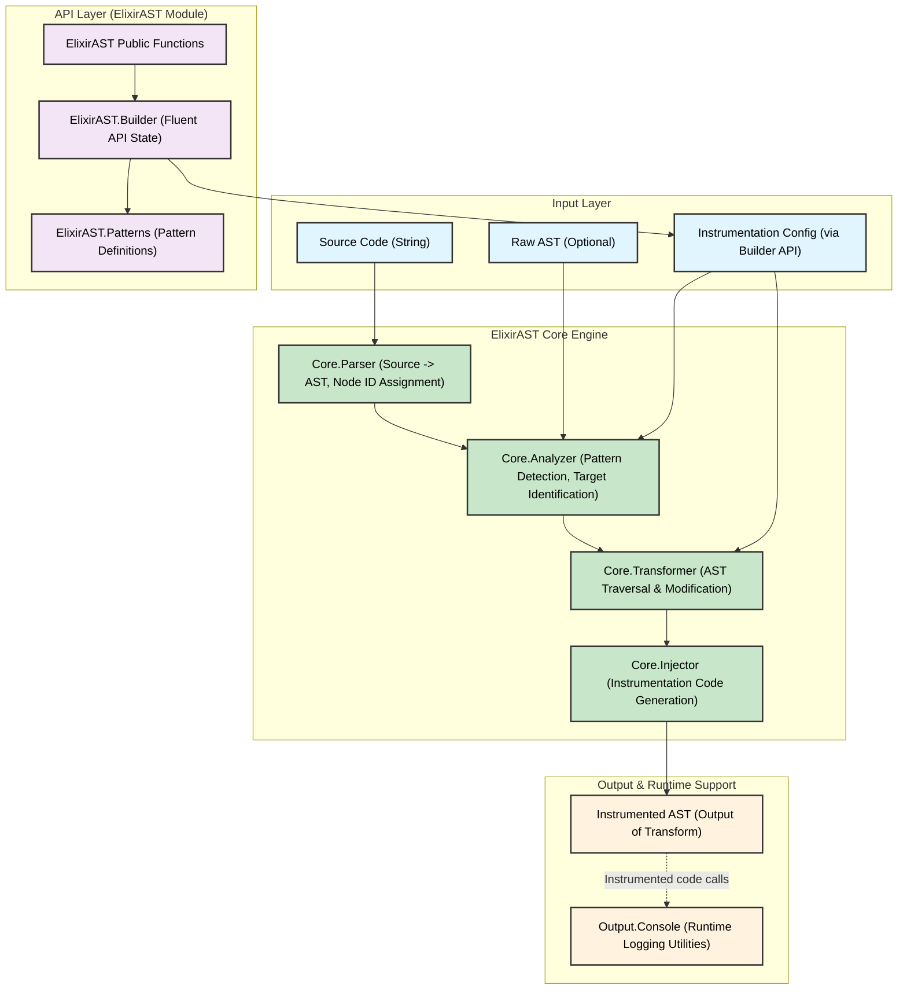
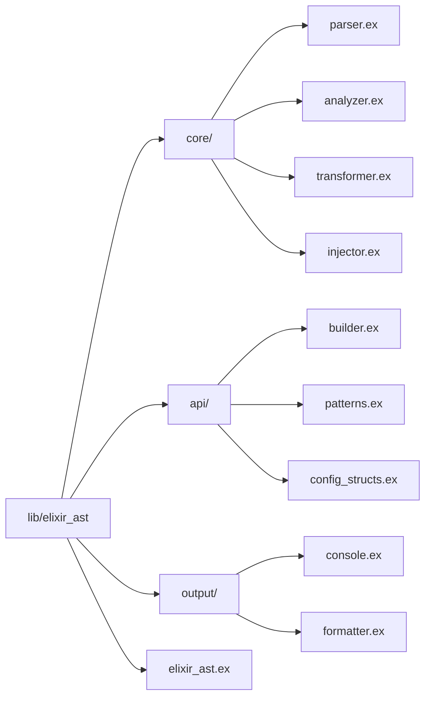
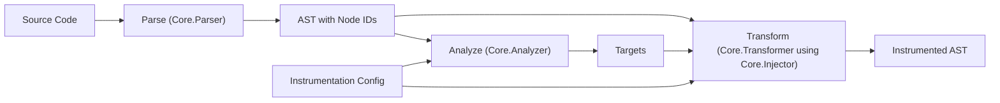

To guide the development of **ElixirAST**, I've created three technical diagrams that illustrate key aspects of its design: the **system architecture**, the **module structure**, and the **AST parsing and transformation flow**. These diagrams provide a clear visual representation of the system's components, their organization, and the data flow, making it easier for developers to understand and implement the project. Each diagram is presented using Mermaid syntax, followed by a brief explanation.

---

## 1. System Architecture Diagram

This diagram provides a high-level overview of ElixirAST’s main components and how they interact. It includes the Input Layer, Core Engine, Output & Runtime Support, and API Layer.

**Explanation:**

* **Input Layer**: This layer accepts source code (as a string), an optional raw AST, and instrumentation configuration built via the API.
* **Core Engine**: This is where the core processing happens. The **Parser** converts source code to an AST with node IDs, the **Analyzer** detects patterns and identifies targets, the **Transformer** modifies the AST, and the **Injector** generates instrumentation code.
* **Output & Runtime Support**: This layer produces the instrumented AST. When executed, this AST calls the **Console Logger** for runtime logging.
* **API Layer**: This layer provides public functions, a fluent **Builder API**, and **pattern definitions** to configure the instrumentation process.

---

## 2. Module Structure Diagram

This diagram shows the internal organization of the ElixirAST library, detailing the relationships between modules and submodules.

**Explanation:**

The root directory `lib/elixir_ast` contains three subdirectories (`core/`, `api/`, `output/`) and a main file (`elixir_ast.ex`).

* **core/**: Houses the core functionality with files for the **Parser**, **Analyzer**, **Transformer**, and **Injector**.
* **api/**: Contains files for the **Builder** (fluent API), **Patterns** (pattern definitions), and configuration structs.
* **output/**: Includes files for console logging and formatting utilities.

This structure helps developers locate and understand the purpose of each file within the codebase.

---

## 3. AST Parsing and Transformation Flow Diagram

This flowchart illustrates the process of transforming source code into an instrumented AST, guided by the instrumentation configuration.

**Explanation:**

* **Source Code**: The process begins with Elixir source code as input.
* **Parse**: The `Core.Parser` converts the source code into an AST and assigns unique node IDs.
* **Analyze**: The `Core.Analyzer` uses the AST with node IDs and the instrumentation configuration to identify **targets** (e.g., nodes to instrument based on patterns).
* **Transform**: The `Core.Transformer`, utilizing the `Core.Injector`, takes the AST, identified targets, and configuration to modify the AST by injecting instrumentation code.
* **Instrumented AST**: The final output is an AST with embedded instrumentation, ready for execution.

---

## Purpose and Usage

These diagrams serve as a visual guide for developers working on ElixirAST:

* **System Architecture Diagram**: Offers a big-picture view of how components interact, helping developers understand the flow from input to output.
* **Module Structure Diagram**: Maps out the codebase, making it easier to navigate and assign tasks.
* **AST Parsing and Transformation Flow Diagram**: Details the core process of AST instrumentation, clarifying the steps and dependencies involved.

By including these diagrams in design documentation or development guides, the team can align their efforts with the intended design, ensuring a modular, efficient implementation of ElixirAST. Each diagram is crafted using Mermaid for easy integration into documentation and collaborative tools.
